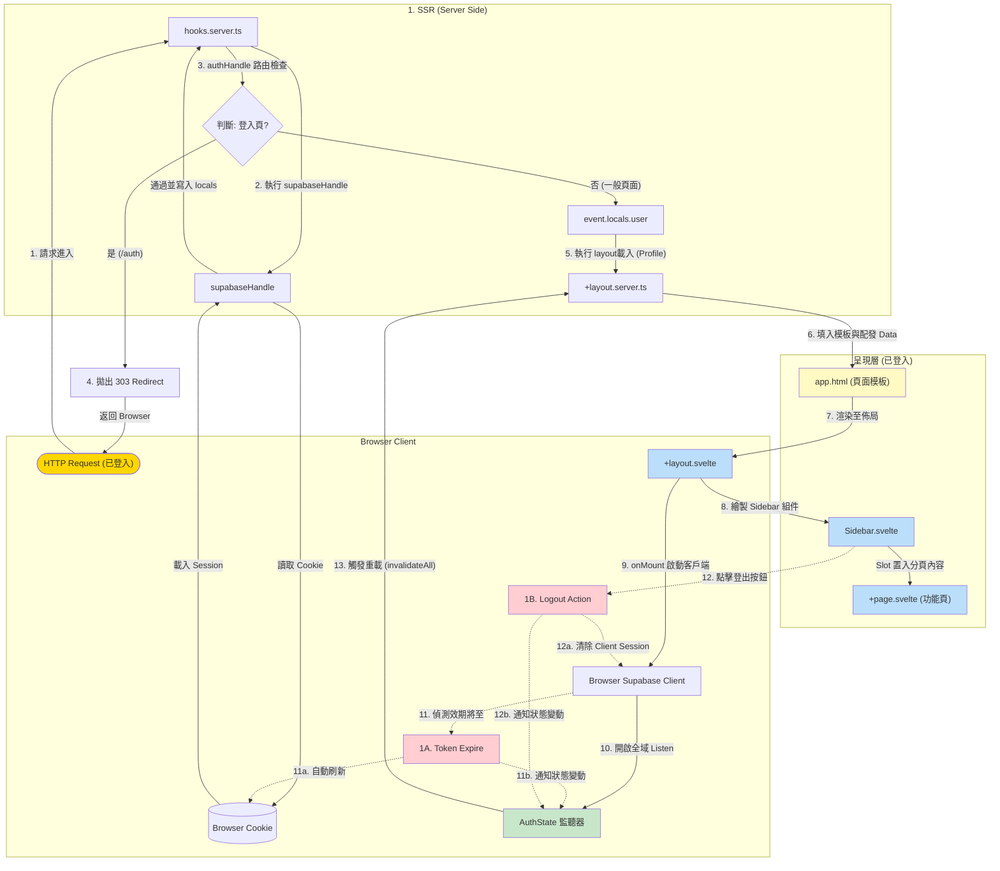
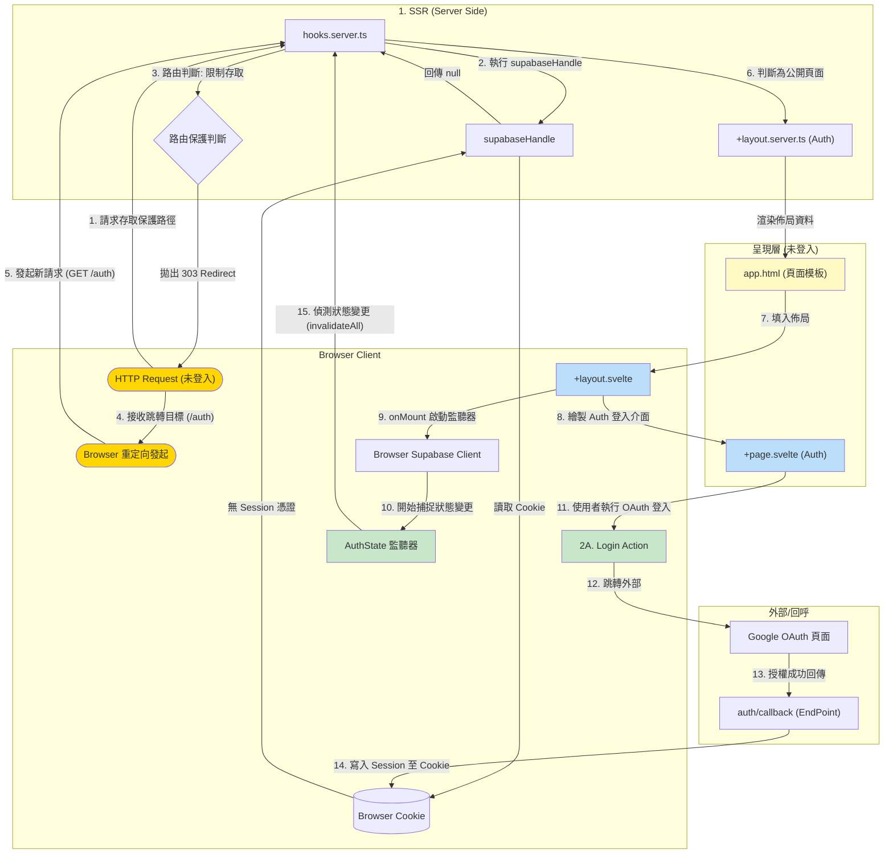
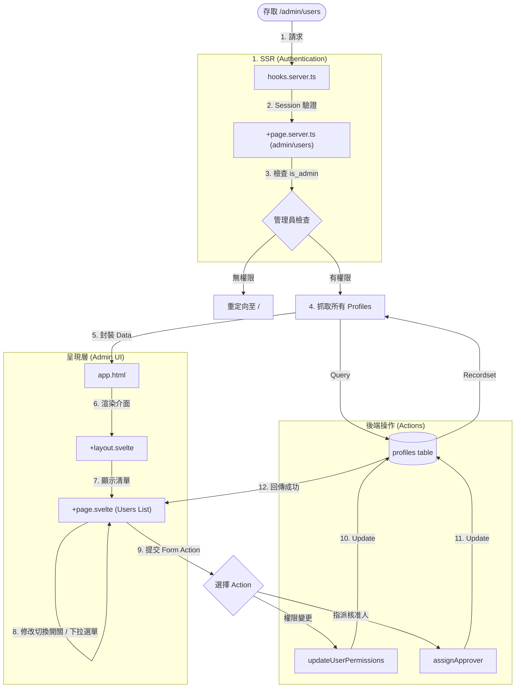
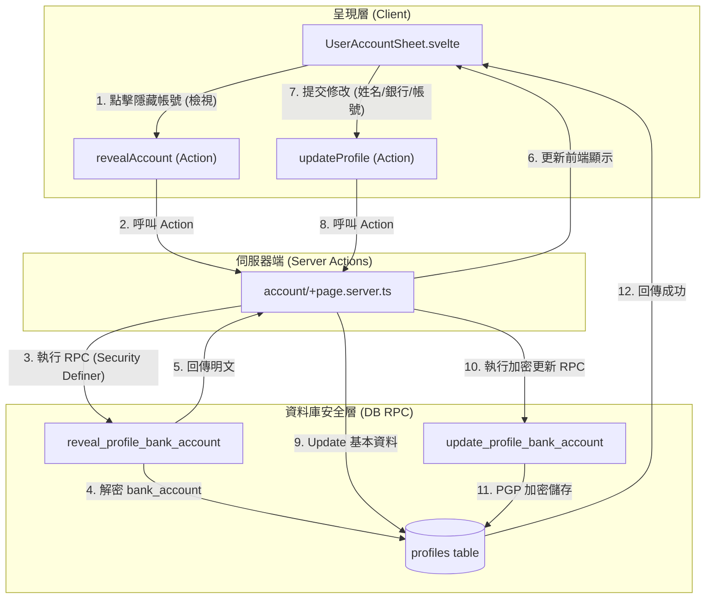

# 04_前端組件關聯與資料流

> 彙整文件：元件互動架構、認證資料流、全域狀態管理  
> 最後更新：2026-02-12

---

## 1. 進入系統 - 已登入

### 1.1 流程圖 (已登入狀態 + 生命週期)

### 1.2 核心資料流說明

1.  **伺服器端請求攔截 (SSR Hooks Phase)**：
    *   **Step 1-2**: 當請求進入伺服器，`hooks.server.ts` 中的 `supabaseHandle` 優先執行。它從 **Request Header** 讀取 `Browser Cookie` 並與 Supabase 伺服器驗證 Session 有效性。
    *   **Step 3-4**: `authHandle` 接手進行路由檢查。若使用者具備 Session 卻嘗試存取 `/auth` (登入頁)，系統會拋出 `303 Redirect` 中斷流程並命令瀏覽器返回首頁。
2.  **資料加載與模板渲染 (Layout & app.html Phase)**：
    *   **Step 5-7**: 通過 Hooks 檢查後，進入 `+layout.server.ts` 獲取使用者 Profile。隨後 SSR 引擎會將生成的 HTML 填入 `app.html` 的 `%sveltekit.body%` 佔位符中，並將 `data` 傳遞給 `+layout.svelte`。
3.  **前端掛載與監聽 (Hydration & OnMount Phase)**：
    *   **Step 8-10**: 頁面在瀏覽器完成掛載後，`+layout.svelte` 的 `onMount` 啟動 `Browser Supabase Client`。隨後開啟 `AuthState` 監聽器，開始捕捉任何憑證變動。
4.  **生命週期子流程 (Lifecycle Sub-flows)**：
    *   **1A (Token 過期)**：背景監聽器發現效期不足時會自動執行隱排刷新，寫回 Cookie 並維持 Session 活躍 (Step 11-11b)。
    *   **1B (主動登出)**：Sidebar 觸發 `signOut()` 後，監聽器偵測到 Auth 狀態變為 `SIGNED_OUT`，隨即呼叫 `invalidateAll()` 觸發 Step 13 的全域重載。

---

## 2. 進入系統 - 未登入

### 2.1 流程圖 (未登入及登入動作)

### 2.2 核心資料流說明

1.  **未授權存取攔截 (The 303 Loop)**：
    *   **Step 1-3**: 使用者請求保護路徑時，`hooks` 偵測到無 Session。`authHandle` 丟出一個 `303 Redirect` 響應。
    *   **Step 4-5**: 瀏覽器接收到重定向指令，中斷原請求，並立即開啟 **第二次 GET 請求** 導向 `/auth` 登入頁面。這是一個完整的網路來回循環。
2.  **登入介面掛載**：
    *   **Step 6-8**: 伺服器將 `/auth` 解析結果填入 `app.html` 並傳送到瀏覽器。`+layout.svelte` 執行 `onMount` 並開始監聽狀態 (Step 9-10)。
3.  **OAuth 認證循環**：
    *   **Step 11-13**: 使用者點擊登入後，請求導向外部 Auth 提供者 (Google)，並附帶 `next` 回跳參數。驗證成功後，外部伺服器回傳至本系統的 `auth/callback` 路由。
    *   **安全規則**：`auth/callback` 會過濾 `next`，僅允許站內相對路徑（例如 `/claims`），拒絕 `//` 或外部 URL 形式。
4.  **Session 同步與重載**：
    *   **Step 14**: Callback 處理程序將新的 Session 存入 `Browser Cookie`。
    *   **Step 15**: 前端的 `AuthState 監聽器` (n28) 捕捉狀態變更，呼叫 `invalidateAll()`。這會導致伺服器重新執行 SSR 流程（包含重新進入 `app.html` 與相關佈局），完成登入狀態切換。

---

## 3. 使用者管理 (Admin Only)

### 3.1 流程圖 (權限與核准人指派)

### 3.2 核心資料流說明

1.  **管理員身份驗證 (Admin Guard)**：
    *   **SSR Check**: 進入 `/admin/users` 前，`+page.server.ts` 會再次從資料庫確認當前 `locals.user.id` 的 `is_admin` 欄位。若非管理員，直接拋出 `303 Redirect` 回首頁。
2.  **資料彙整與清單顯示**：
    *   **Profiles Table Query**: 伺服器會直接從 `profiles` 資料表中拉取「所有使用者清單」與「可供指派的核准人選項」，格式化後配發至前端資料表顯示。
3.  **權限與核准人異動**：
    *   **Atomic Updates**: 管理員在介面操作時（如切換財務權限），會觸發對應的 `Form Action`。後端直接針對 `profiles` 表進行 `update` 操作。
    *   **Approver Logic**: 指派核准人會更新目標使用者的 `approver_id`，這將直接影響該使用者後續提交申請單時的預設核准路徑。

---

## 4. 個人資料管理 (User Account Sheet)

### 4.1 流程圖 (敏感資料加密路徑)

### 4.2 核心資料流說明

1.  **敏感資料揭露 (Reveal Logic)**：
    *   **Encrypted Storage**: 銀行帳號 (`bank_account`) 在資料庫中是以 `bytea` 格式加密儲存的。
    *   **Security RPC**: 前端無法直接選取該欄位，必須透過 `revealAccount` Action 呼叫專屬 RPC。該 RPC 內部使用 `pgp_sym_decrypt` 並檢查身份（僅限本人或管理員），確保安全性。
2.  **資料更新雙路徑 (Two-Way Update)**：
    *   **Basic Data**: 姓名、銀行名稱等非敏感欄位，透過標準的 `supabase.update()` 直接寫入。
    *   **Sensitive Data**: 若使用者修改了帳號，Action 會額外呼叫 `update_profile_bank_account` RPC。該函數將原始文字加密後才存入資料庫，實現「前端不經手金鑰，後端不存儲明文」的安全機制。
3.  **即時反應**：
    *   更新成功後，透過 `svelte-sonner` 彈出通知，並藉由 SvelteKit 的資料重載機制維持介面與資料庫同步。

graph TD
    subgraph "頂部：個人化問候與快速動作"
        A[👋 歡迎，王小明！] --- B(⊕ 新增請款單)
    end

    subgraph "第二排：關鍵指標卡片 (Role-based)"
        C[草稿案件: 3]
        D[審核中: 5]
        E[駁回/待修: 2]
        F[待核准: 12]
    end

    subgraph "第三排：主要內容區"
        G[最新動態 - 列表式] 
        H[統計圖表 - 支出趨勢]
    end