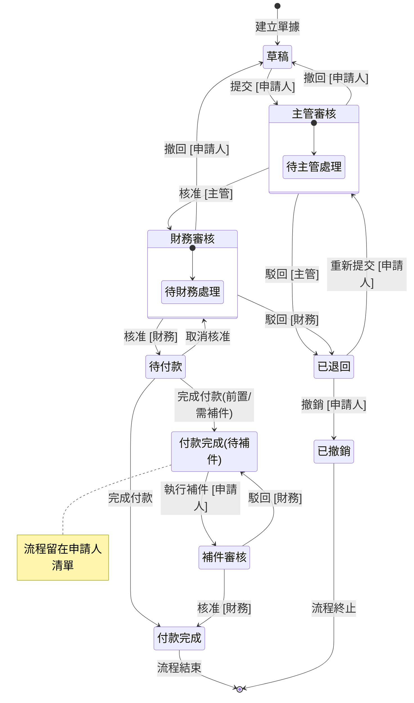

# 01_產品藍圖與開發計畫

> 彙整文件：產品規格書 (PRD)、開發計劃  
> 最後更新：2026-02-11

---

## 📖 目錄

- [1. 產品規格書 (PRD)](#1-產品規格書-prd)
    - [1.1 專案概觀](#11-專案概觀-project-overview)
    - [1.2 角色與權限設計 (RBAC)](#12-角色與權限設計-rbac)
    - [1.3 請款單業務流程與狀態機 (Business Workflow & State Machine)](#13-請款單業務流程與狀態機-business-workflow--state-machine)
    - [1.4 使用者介面與導航架構 (UI/UX)](#14-使用者介面與導航架構-uiux--navigation)
    - [1.5 功能模組細部說明](#15-功能模組細部說明)
    - [1.6 資料欄位定義 (Data Schema)](#16-資料欄位定義-data-schema)
    - [1.7 非功能性需求 (NFR)](#17-非功能性需求-nfr)
    - [1.8 自動化與通知 (Automation & Notifications)](#18-自動化與通知-automation--notifications)
    - [1.9 資料安全與隱私](#19-資料安全與隱私-data-security--privacy)
    - [1.10 效能指標 (Performance SLO)](#110-效能指標-performance-slo)
    - [1.11 災難還原與可靠性](#111-災難還原與可靠性-resilience)
    - [1.12 未來擴充項目](#112-未來擴充項目-optional)
- [2. 開發計劃](#2-開發計劃)
    - [2.1 開發階段總覽](#21-開發階段總覽)
    - [2.2 階段任務細節 (Phase 0 ~ 9)](#22-階段任務細節-phase-0--9)
    - [2.3 開發原則](#23-開發原則)
    - [2.4 里程碑與風險](#24-里程碑與風險)
    - [2.5 建議專案結構](#25-建議專案結構)

---

## 1. 產品規格書 (PRD)

### 1.1 專案概觀 (Project Overview)

- **專案名稱**：請款系統
- **專案目標**：
    本系統為企業內部請款與付款流程管理平台，目的在於： 
    - 標準化請款流程，降低人工作業風險
    - 提高審核透明度與可追蹤性
    - 明確區分申請人、主管、財務三種角色權責
    - 支援草稿、補件、撤回、付款等實務情境
- **核心價值**：提升財務流程效率，確保每筆支出都有跡可循。

---

### 1.2 角色與權限設計 (RBAC)

#### 1.2.1 權限取得規則

系統採用「權限旗標」與「關係指派」混合模式，各項權限**互不相斥**（即同一人可同時擁有申請、主管、財務與管理員權限）：

- **申請人 (預設)**：所有使用者登入後皆具備此角色。
  - **必要條件**：每一位使用者皆必須由管理員指派一名「**核准人**」。
- **主管 (核准人)**：
  - **取得條件**：當使用者被管理員設定為任一其他人的「核准人」時，自動開啟此權限。
- **財務**：
  - **取得條件**：由管理員在後台顯式開啟「財務權限」旗標。
- **管理員**：
  - **取得條件**：由系統預設或既有管理員開啟「管理員權限」旗標。

#### 1.2.2 職責對照表

| 角色 | 權限取得方式 | 核心職責 | 權限範圍 |
| :--- | :--- | :--- | :--- |
| **申請人** | 系統預設 | 建立與維護請款單 | 新增/編輯、提交/撤回、補件。僅能查看「自己建立」的單據。 |
| **主管** | 被指派為他人核准人 | 第一關審核 | 審核(核准/駁回)被指派屬員的單據。僅能檢視以自己為核准人的單據。 |
| **財務** | 管理員開啟旗標 | 最終審核與付款 | 全系統檢視、最終審核、補件審核、執行付款、廠商異動管理。 |
| **管理員** | 系統/旗標開啟 | 系統導航與設定 | 指派核准人、開關財務/管理員權限、使用者管理。 |

---

### 1.3 請款單業務流程與狀態機 (Business Workflow & State Machine)

#### 1.3.1 主要狀態定義

- **草稿**：填寫中或被撤回。
- **主管審核**：待直屬主管核准。
- **財務審核**：主管已核准，待財務確認。
- **補件審核**：申請人完成補件，待財務重審。
- **已退回**：被主管或財務駁回，待修正。
- **待付款**：財務核准，進入出納清單。
- **付款完成**：流程結束。
- **付款完成(待補件)**：已先付款，但憑證尚未補齊。
- **已撤銷**：申請人主動放棄流程，流程結束。

#### 1.3.2 流程與狀態機可視化 (State Diagram)


#### 1.3.3 詳細轉換邏輯與規範

> [!NOTE]
> **前置條件**：申請人必須已由管理員指派「核准人」，否則無法執行「提交」動作。員工報銷類別另須確認員工已設定匯款帳號。

1. **草稿** → `提交` [申請人] → **主管審核**
2. **主管審核** → `核准` [主管] → **財務審核**
3. **主管審核** → `駁回` [主管] → **已退回**
4. **主管審核** → `撤回` [申請人] → **草稿**
5. **財務審核** → `核准` [財務] → **待付款**
6. **財務審核** → `駁回` [財務] → **已退回**
7. **財務審核** → `撤回` [申請人] → **草稿**
8. **待付款** → `完成付款` [財務] → **付款完成**
9. **待付款** → `完成付款 (需補件)` [財務] → **付款完成(待補件)**
10. **待付款** → `取消核准` [財務] → **財務審核**
11. **付款完成(待補件)** → `補件處理` (包含補傳附件或填寫原因) [申請人] → **補件審核**
12. **補件審核** → `核准` [財務] → **付款完成**
13. **補件審核** → `駁回` [財務] → **付款完成(待補件)**
14. **已退回** → `重新提交` [申請人] → **主管審核**
15. **已退回** → `撤銷` [申請人] → **已撤銷**

> [!IMPORTANT]
> **已退回單據不可刪除**：與「草稿」不同，「已退回」狀態的單據僅能「重新提交」或「撤銷」，不提供刪除功能，以保留完整審核軌跡。

> [!WARNING]
> **取消付款規則**：
> - 取消付款僅能針對「付款單」執行，不能針對單筆請款單單獨操作。
> - 若付款單內含有「補件審核」狀態的請款單，財務須先核准或駁回該補件審核後，才能執行取消付款。
> - 取消付款後，請款單狀態處理：
>   - **一般付款完成**：退回至「待付款」狀態。
>   - **經補件審核後付款完成**：退回至「待付款」狀態，且保留已補上的附件資訊 (標記為「已有憑證」)。

#### 1.3.4 廠商資料狀態 (Vendor Data)

- **待審核 (Pending Audit)**：使用者提交新增/修改/停用申請後，財務審核中，不可用於請款單。
- **已通過 (Approved)**：財務核准後，該資料可正式用於請款單。
- **已停用 (Disabled)**：廠商不再合作，系統內將過濾掉此廠商，不可發起新請款。

#### 1.3.5 待補件狀態處理邏輯

為了在系統面區分「純粹付款完成」與「付完款但缺憑證」，建議設計如下：

- **識別機制 (Identification Mechanism)**：
  - 請款單資料結構包含「**先付款後補憑證**」布林欄位。
  - 系統依據該單據是否勾選此項目，決定財務執行「完成付款」後的流向：
    - **已勾選**：狀態轉為 `付款完成(待補件)`，流程繼續掛載於申請人待處理清單。
    - **未勾選**：狀態轉為 `付款完成`，流程正式結束。
- **UI 表現差異**：
  - **付款完成**：顯示綠色標籤，代表流程最終結束。
  - **付款完成(待補件)**：標籤顯示橘色/黃色，並於申請人的「待處理」清單中持續顯示，直到補件審核通過。
- **行為限制**：
  - 在 `付款完成(待補件)` 狀態下，申請人僅能進行「**補件處理**」：
    - **選項 A (補憑證)**：更新「發票號碼」、「發票日期」與「上傳附件」。
    - **選項 B (無法取得)**：勾選「無法取得憑證」並強制填寫「無法取得原因」。
  - 其餘金額與廠商資訊應鎖定不可修改。

---

### 1.4 使用者介面與導航架構 (UI/UX & Navigation)

#### 1.4.1 核心架構：分層檢視設計

考量到請款單資訊量（如多筆明細、大圖憑證），系統採用「**清單主頁 + 全頁詳情**」的直覺架構：

- **主清單頁**：主要工作區，提供資料過濾、排序與快速狀態概觀。
- **全頁詳情 (Full Page Detail)**：點擊單據後跳轉至專屬頁面。採用 **2:1 分割佈局**：
  - **左側 (2/3)**：顯示資訊內容（申請理由、消費項目表格）與完整的審核時間軸。
  - **右側 (1/3)**：固定顯示憑證影像與摘要資訊，確保檢核時無需來回滾動。
- 模態視窗/抽屜：用於簡單的廠商編輯或快速設定。
- **響應式設計 (RWD)**：系統需支援行動裝置瀏覽，確保在平板與手機上仍有良好的操作體驗。

#### 1.4.2 共用介面組件 (Shared UI Components)

為了維持操作一致性，所有清單頁面（我的請款、歷程記錄、廠商管理、所有單據）需具備：

- **搜尋功能**：
    - **單據類清單**：搜尋單號、付款對象、請款說明。
    - **廠商清單**：搜尋廠商名稱。
- **篩選條件**：
    - **共通**：日期區間 (起/迄)。
    - **單據類**：單據類別 (員工/廠商/勞務)、請款狀態。
    - **審核頁面**：申請人 (User/Dept)。
- **排序規則**：預設依「更新時間」降冪排列 (最新在前)。

#### 1.4.3 導航設計 (Navigation)

1. **側邊選單 (Sidebar)**：維持在左側，提供模組切換。
   - 🏠 **我的請款** (核心清單)
   - ✅ **申請審核** (限主管/財務/管理員)
   - 🏢 **廠商管理**
   - 👤 **個人帳戶** (個人基本資料、匯款帳戶設定)
   - ⚙️ **使用者設定**
   - **說明文件** (手冊、FAQ)
2. **視覺補強 (Visual Filling)**：
   - **底部個人資訊卡 (User Card)**：在選單最下方放置登入者頭像、姓名與角色。
   - **快速入口**：側邊欄頂部放置顯眼的「+ 新增申請」按鈕。
   - **自適應選單**：依據 RBAC 權限動態顯示項目，即便項目少也能透過排版設計展現專業感。
3. **麵包屑 (Breadcrumbs)**：位於畫面上方，讓使用者在深入單據詳情後，隨時能一鍵返回清單主頁。

---

### 1.5 功能模組細部說明

#### 模組一：首頁與發起

- **快速入口**：一鍵「新增請款單」。
- **新增操作**：
  - **廠商名稱選單**：填寫廠商請款時，廠商名稱欄位為下拉式選單，支援搜尋功能以定位特定廠商；亦可於選單中點選「新增廠商」，跳轉至廠商新增頁面。
  - **儲存草稿**：資料存檔，暫不進入審核。
  - **提交審核**：雙重確認後送交主管 (若未設定核准人，系統將阻擋提交並提示聯繫管理員)。

#### 模組二：我的請款單 (申請人視角)

- **分類導覽**：
  - **草稿箱**：可進行編輯或刪除。
  - **處理中**：追蹤目前進度（主管/財務/待付款），支援「撤回」。
  - **待處理**：包含「已退回」（需修正）與「待補件」（僅限檔案上傳）。
  - **歷程記錄**：查看所有歷史單據。

#### 模組三：申請審核 (主管/財務視角)

- **待辦清單**：顯示所有待審核單據，提供快速核准/駁回入口。
- **財務專區**：
  - **待付款清單**：執行付款並記錄付款日期，支援「取消核准」退回上一步。
  - **批次付款**：支援選取多筆「待付款」單據同時執行付款完成。
    - **限制條件**：僅限同一付款對象 (同一廠商或同一員工)，無金額與筆數上限。
    - **付款單生成**：系統自動合併生成一張「付款單」，財務可於「付款清單」中查看所有付款單記錄。
  - **付款清單**：查看所有已生成的「付款單」記錄，包含單筆付款與批次付款合併產生的付款單。
    - **取消付款**：僅能針對付款單執行，取消後該付款單內所有請款單均退回對應狀態。
  - **廠商異動審核**：審核由使用者發起的「新增、修改、停用」廠商申請，核准後同步更新廠商主檔。
  - **所有單據**：供財務進行全域查詢與管理。

---

### 1.6 資料欄位定義 (Data Schema)

為了確保系統擴充性，系統採用「主單 (Main) + 明細 (Items)」的結構，區分為「全域共用欄位」與「單據類別專屬欄位」。明細欄位高度共用，僅各類別支援的筆數與特定擴展功能有所差異。

#### 1.6.1 共用欄位定義 (Common Fields)

**A. 主單全域欄位 (Header)**
- **系統識別**：單號 (ID)、狀態 (Status)、建立時間、更新時間。
- **申請主體**：申請人 (User ID)。
- **財務核心**：總金額 (Total Amount)、幣別 (僅支援 TWD，不支援外幣及匯率換算)。
- **附件總表**：全清單各項憑證影像的總索引。
- **審核歷程**：所有節點的動作、人員、時間與備註。

**B. 明細共用欄位 (Line Items)**
- **時間/期間**：日期 (Date) 或 勞務起迄期間。
- **分類項目**：費用類別 (Category)，由管理員於系統設定中維護清單。
- **內容說明**：費用說明 / 交易內容 / 勞務案由。
- **金流資訊**：金額 (Amount)。
- **憑證資訊**：發票/收據號碼、發票日期、憑證影像 (Attachment)。
  - **附件數量限制**：員工報銷/廠商請款 — 每筆交易項目限 1 個附件；個人勞務 — 需上傳 3 個附件 (身分證正反面、存摺影本)。
- **異常處理**：無憑證標記 (No Evidence Flag)、無法取得說明。

#### 1.6.2 類別對照與明細筆數 (Type Comparison)

| 功能區域 | 員工報銷 (Employee) | 廠商請款 (Vendor) | 個人勞務 (Personal Service) |
| :--- | :--- | :--- | :--- |
| **明細數量** | **多筆 (Multi-Items)** | **多筆 (Multi-Items)** | **單筆 (Single Item)** |
| **對象資訊** | (登入者本人) | **廠商名稱** | **姓名**、**身分證字號**、**Email**、**戶籍地址** |
| **匯款帳戶** | (預設員工帳戶) | 自動連動廠商銀行資料 | **銀行名稱**、**銀行帳號** |
| **特定附件** | (隨明細附掛憑證) | (隨明細附掛憑證) | **身分證正反面**、**存摺影本** |
| **憑證規則** | 發票號碼、日期、候補標記 | 發票號碼、日期、候補標記 | (不適用發票，採勞務領據) |

#### 1.6.3 憑證識別策略 (僅限廠商/員工)

- **已取得發票**：輸入發票號碼、日期 + 上傳附件。
- **憑證後補**：暫不輸入號碼，狀態轉為「付款完成(待補件)」。
- **無法取得**：勾選「無法取得」，並強制填寫「無法取得原因」。

#### 1.6.4 員工個人資料格式 (Employee Profile)

系統維護員工基本資訊，用於報銷單據自動帶入及財務匯款：
- **身份辨識**：姓名、員工編號 (ID)、所屬部門、職稱、Email。
- **匯款資訊**：銀行代碼、銀行名稱、分行名稱、匯款帳號。
- **系統權限**：系統角色 (Role: 申請人/主管/財務/管理員)。

#### 1.6.5 廠商基本資料格式 (Vendor Profile)

系統維護廠商資料，需經財務審核通過後方可開始請款：
- **基本資訊**：廠商名稱 (正式公司或個人全名)、服務內容/營業項目。
- **匯款帳項**：銀行代碼、銀行帳號。
- **進階設定**：設為浮動帳號 (Flag)。
    - *說明：勾選後，每次申請請款時皆可手動修改該廠商的匯款資訊。*
    - *使用情境：部分廠商使用「虛擬帳號」，每次交易由廠商給予請款方不同帳號，系統須允許逐次輸入。*
- **審核狀態**：待審核、已通過、已停用。

#### 1.6.6 廠商異動申請 (Vendor Change Request)

記錄使用者對廠商資料的異動請求：
- **異動類型**：新增 (Create)、修改 (Update)、停用 (Disable)。
- **異動內容**：記錄異動前與異動後的資料差異 (Snapshot)。
- **申請原因**：簡述為何需要進行此異動。
- **審核歷程**：財務的核准/駁回意見。

#### 1.6.7 憑證檔案管理 (Attachment Management)

為避免儲存空間無限增長並確保憑證與交易紀錄的一致性，系統採用以下管理機制：

**A. 憑證識別與命名規則**
- **憑證 ID**：每筆交易明細 (Line Item) 綁定一個唯一的憑證 ID (`attachment_id`)。
- **檔案命名格式**：`{claim_id}_{item_index}_{timestamp}.{ext}`
  - 範例：`CLM20260207001_01_1707292800.pdf`
- **儲存路徑**：`/claims/{claim_id}/attachments/`

**B. 憑證與交易紀錄綁定**
- 每筆交易明細記錄包含：
  - `attachment_id`：憑證唯一識別碼
  - `attachment_url`：憑證的 Signed URL (透過 Supabase Storage 產生)
  - `attachment_status`：`pending` (待上傳) / `uploaded` (已上傳) / `none` (無憑證)
- 前端顯示時透過 `attachment_id` 取得對應憑證 URL。

**C. 憑證生命週期管理**
| 使用者操作 | 後台行為 |
| :--- | :--- |
| **上傳新憑證** | 產生新 `attachment_id`，儲存檔案，更新交易紀錄的 URL |
| **更換憑證** | 刪除舊檔案，上傳新檔案 (沿用原 `attachment_id` 或產生新 ID)，更新 URL |
| **刪除憑證** | 刪除 Storage 中的檔案，將 `attachment_status` 設為 `none` |
| **刪除草稿/交易項目** | 同步刪除關聯的所有憑證檔案 |

**D. 儲存空間優化**
- **即時清理**：憑證刪除或更換時，舊檔案立即從 Storage 移除。
- **孤立檔案檢查**：定期 (如每週) 執行背景任務，清理無任何交易紀錄關聯的孤立憑證檔案。
- **軟刪除保護**：已提交 (非草稿) 的請款單，其憑證不可被刪除，僅能於「補件」流程中更換。

---

### 1.7 非功能性需求 (NFR)

- **資料一致性**：所有狀態異動與關鍵操作皆需記錄完整的審核 Log。
- **安全性**：落實 RBAC 權限控管，嚴禁跨越權限讀取他人單據。
- **操作安全**：針對「撤銷」以及動作會移轉至下一個角色的動作需執行二次確認。
- **防呆與檢查 (Validation Rules)**：
    - **核准人檢查**：提交審核時，系統自動檢核申請人是否已設定「核准人」。若未設定，阻擋提交並顯示提示訊息。
    - **員工帳號檢查**：員工報銷類別提交時，系統檢核申請人是否已設定匯款帳號。若未設定，阻擋提交並提示至個人帳戶頁面補充。
    - **金額驗證**：所有金額欄位必須大於 0，於欄位輸入時直接限制 (不允許輸入 0 或負數)。
    - **發票格式**：發票號碼需符合格式驗證（如：2位大寫英文 + 8位數字）。
    - **檔案限制**：僅支援 PDF、JPG、PNG 格式 (檔案選擇器直接過濾，不允許選擇其他格式)，單一檔案大小上限為 10MB。
    - **流程鎖定**：補件狀態下鎖定金額與廠商欄位，僅允許修改憑證。
- **稽核軌跡詳情 (Audit Trail Details)**：
    - 系統需記錄：異動人員、異動時間、來源狀態、目標狀態、執行動作、異動內容快照 (JSON format)。
- **系統衝突處理 (Conflict Handling)**：
    - **廠商停用**：若廠商被停用，進行中的請款單仍可完成流程，但不可發起該廠商的新請款。
    - **重複提交**：針對相同發票號碼且相同廠商的單據，系統需發出重複警示。
- **語系支援**：目前僅支援繁體中文介面，暫不提供多語系切換。

#### 1.7.1 錯誤訊息規範 (Error Messages)

為確保使用者體驗一致，各類驗證失敗時顯示之錯誤訊息定義如下：

| 驗證情境 | 觸發動作 | 訊息內容 | 建議動作 |
| :--- | :--- | :--- | :--- |
| 核准人未設定 | 申請人提交 | 「您尚未指定核准人，請聯繫管理員進行設定。」 | 顯示管理員聯繫方式或連結 |
| 員工匯款帳號未設定 | 申請人提交 (員工報銷) | 「您尚未設定匯款帳號，請先至個人帳戶頁面補充。」 | 提供跳轉至個人帳戶頁面的按鈕 |
| 發票號碼格式錯誤 | 欄位輸入時 | 「發票號碼格式不符，請輸入 2 位大寫英文 + 8 位數字。」 | 顯示範例格式 |
| 檔案超過大小限制 | 檔案上傳時 | 「檔案大小不得超過 10MB，請壓縮後重新上傳。」 | - |
| 重複發票號碼 ⚠️ | 申請人提交 / 主管核准 / 財務核准 | 「此發票號碼已存在於其他單據中，請確認是否重複。」(僅為提醒，不阻擋) | 顯示重複發票對應資訊：申請單號、付款對象、金額、交易內容 |
| 廠商未選擇 | 申請人提交 (廠商請款) | 「請選擇廠商或新增廠商後繼續。」 | 聚焦至廠商選單 |
| 批次付款對象不一致 | 財務執行批次付款 | 「批次付款僅限同一付款對象，請重新選擇。」 | 提示使用者篩選單一對象 |

---

### 1.8 自動化與通知 (Automation & Notifications)

#### 1.8.1 狀態變更通知

當單據狀態發生異動時，系統自動發送通知（如：站內信或 Email）給權益關係人：
- **通知對象**：
    1.  **下一個處理者**：通知該角色有待辦事項 (例如：主管、財務)。
    2.  **原申請者**：通知進度異動 (例如：單據被駁回、補件請求、付款完成)。
- **免通知原則**：若狀態變更的觸發者與接收者為同一人，則不發送通知。

#### 1.8.2 Email 通知機制

- **發送服務**：使用 **Google Workspace SMTP**，透過公司網域 (如 `noreply@company.com`) 發送通知信。
- **技術實作**：透過 **Supabase Edge Functions** 呼叫 SMTP 服務發送 Email。
- **每日限額**：Workspace 帳號每日最多 2,000 封，對內部系統通知量綽綽有餘。
- **通知內容**：包含單據單號、狀態變更摘要、快速連結至單據詳情頁。

---

### 1.9 資料安全與隱私 (Data Security & Privacy)

由於涉及敏感個人資料（身分證字號、匯款帳號、員工個資），系統須遵守以下原則：
- **靜態加密 (Encryption at Rest)**：所有儲存於 PostgreSQL 的銀行帳號與身分證號需進行加密存儲。
- **檔案權限**：憑證影本儲存於 Supabase Storage 的私有目錄，僅具備關聯單據讀取權限的人員可透過簽名 URL (Signed URL) 存取。
- **認證機制 (Authentication)**：
    - **登入方式**：採用 Supabase Auth 搭配 Google OAuth 2.0 進行單一登入 (SSO)。
    - **Session 管理**：登入後由 Supabase 管理 Session，若 Session 過期系統將自動導向至登入頁面。
    - **組織限制**：僅接受特定企業網域 (如 @company.com) 的 Google 帳號進行註冊。

---

### 1.10 效能指標 (Performance SLO)

為了達成「零延遲」的使用者體驗，系統開發需符合以下標竿：
- **前端導航延遲**：頁面切換時間 < 100ms (透過 SvelteKit Prefetching 達成)。
- **API 響應時間**：核心審核與資料查詢 API 平均響應時間 < 300ms。
- **資料最終一致性**：狀態更新後，全域清單需在 1 秒內反應最新狀態。

---

### 1.11 災難還原與可靠性 (Resilience)

- **自動備份**：資料庫每日進行物理備份，確保 RPO (復原點目標) < 24 小時。
- **冪等性設計 (Idempotency)**：付款動作相關 API 必須具備冪等性，防止重複提交導致的重複撥款風險。

---

### 1.12 未來擴充項目 (Optional)

- **多層級審核**：根據金額自動判斷是否需要高階主管介入
- **外部整合**：串接 Email 自動通知。
- **行動化**：支援手機端拍照即時上傳憑證。

---

## 2. 開發計劃

> 最後更新：2026-02-11  
> 預估開發時程：8-10 週  

### 2.1 開發階段總覽

> **開發策略**：先求通，再求精 (Walking Skeleton)  
> 資料結構先行 + 核心依賴優先。考量到「收款人」是請款單的基礎，調整開發順序。

| 階段 | 名稱 | 預估時間 | 狀態 |
|:---:|------|:--------:|:----:|
| 0 | 環境建置 + 專案初始化 | 0.5 週 | ✅ |
| 1 | Database Schema 建立 | 0.5 週 | ✅ |
| 2 | UI 元件庫 | 0.5 週 | ✅ |
| 3 | 使用者模組 (Auth/Admin/Profile) | 0.5 週 | ✅ |
| 4 | **收款人管理 (Payee Management)** | 1 週 | ✅ |
| 5 | **請款核心 (Claim Creation)** | 2 週 | ⬜ |
| 6 | 審核流程 (Audit Workflow) | 1.5 週 | ⬜ |
| 7 | 付款模組 (Payment Module) | 1 週 | ⬜ |
| 8 | 通知系統 | 0.5 週 | ⬜ |
| 9 | 測試與優化 | 1 週 | ⬜ |

**為什麼這樣安排？**

1. **DB Schema 先完成** — 資料結構是基礎，避免後續反覆修改
2. **垂直切片** — 每個功能前後端一起做，完成即可測試
3. **SvelteKit 特性** — `+page.server.ts` 天生就是前後端寫在一起

---

### 2.2 階段任務細節 (Phase 0 ~ 9)

#### 階段 0：環境建置 (0.5 週)

- [x] **0.1 專案初始化**
  - [x] 建立 SvelteKit 專案 (`npx create svelte@latest`)
  - [x] 設定 TypeScript
  - [x] 設定 Tailwind CSS
  - [x] 建立 `.env.example` 環境變數範本

- [x] **0.2 Supabase 設定**
  - [x] 建立 Supabase 專案
  - [x] 設定 Google OAuth 認證
  - [x] 設定企業網域限制 (@company.com)
  - [x] 建立 Storage bucket (憑證存放)

- [x] **0.3 版本控制**
  - [x] 初始化 Git 倉庫
  - [x] 建立 `.gitignore`
  - [x] 連結 GitHub 倉庫
  - [x] 分支策略：直接使用 `main`（獨立開發簡化版）

- [x] **0.4 部署設定**
  - [x] 連結 Vercel
  - [x] 設定環境變數
  - [x] 測試自動部署

- [x] **0.5 測試架構設定**
  - [x] 安裝 Vitest + Testing Library
  - [x] 安裝 Playwright
  - [x] 建立 `vitest.config.ts`
  - [x] 建立 `playwright.config.ts`
  - [x] 設定 package.json scripts

**驗收標準**：
✅ 專案可本地運行  
✅ 可成功部署至 Vercel  
✅ Supabase 連線正常  
✅ `npm run test` 可執行  
✅ `npm run test:e2e` 可執行

---

#### 階段 1：基礎架構 (1 週)

- [x] **1.1 資料庫 Schema**
  - [x] 建立 profiles 表
  - [x] 建立 claims 表
  - [x] 建立 claim_items 表
  - [x] 建立 claim_history 表
  - [x] 建立 payees 表 (收款人主檔)
  - [x] 建立 payee_change_requests 表
  - [x] 建立 payments 表
  - [x] 建立 expense_categories 表
  - [x] 建立 Enum 類型 (claim_status, claim_type, vendor_status...)
  - [x] 設定 RLS 策略

- [x] **1.2 UI 設計系統**
  - [x] 定義色彩變數 (CSS Variables) — 於 `app.css` 中定義 Light/Dark 模式
  - [x] 建立 Typography 規範 — 由 Tailwind CSS 提供
  - [x] 建立 Button 元件 (Primary / Secondary / Danger)
  - [x] 建立 Input / Select / Textarea 元件
  - [x] 建立 Card 元件
  - [x] 建立 Badge 元件 (狀態標籤) — 含業務專用 `StatusBadge`
  - [x] 建立 Modal 元件 — 使用 `dialog` 元件
  - [x] 建立 Toast 通知元件 — 使用 `sonner` 元件
  - [x] 額外安裝：table, label, separator, scroll-area, dropdown-menu, avatar, tooltip, popover
  - [x] 安裝圖標庫：lucide-svelte

- [x] **1.3 佈局元件**
  - [x] 建立 Sidebar 導航 — `src/lib/components/layout/Sidebar.svelte`
  - [x] 建立 Breadcrumb 元件 — `src/lib/components/layout/Breadcrumb.svelte`
  - [x] 建立 PageLayout 包裝元件 — `src/lib/components/layout/PageLayout.svelte`
  - [x] 建立 Loading / EmptyState 元件 — `src/lib/components/shared/`

**驗收標準**：
✅ 所有資料表建立完成  
✅ RLS 策略測試通過  
✅ UI 元件庫完整可用 (22 個元件，編譯驗證通過)

---

#### 階段 3：使用者模組 (1 週)

- [x] **2.1 認證流程**
  - [x] 實作 Google OAuth 登入頁
  - [x] 實作 登入 callback 處理 (含 Profile 自動建立)
  - [x] 實作 登出功能
  - [x] 實作 Session 管理 (hooks.server.ts)
  - [x] 實作 未登入保護 (redirect)
  - [x] 實作 RBAC 路由保護 (Admin/Finance)

- [x] **2.2 個人帳戶頁**
  - [x] 顯示基本資料 (姓名、Email、部門)
  - [x] 顯示目前角色狀態
  - [x] 編輯匯款資訊 (含加密存儲)
  - [x] 匯款欄位驗證

- [x] **2.3 使用者管理 (Admin)**
  - [x] 使用者清單頁面
  - [x] 指派核准人功能
  - [x] 開關財務/管理員權限
  - [x] 搜尋使用者

**驗收標準**：
✅ Google 登入可正常使用  
✅ 權限控管正確 (驗證各角色存取)  
✅ 個人資料可編輯並儲存

---

#### 階段 4：收款人管理 (Payee Management) (1 週)

- [x] **4.1 收款人列表頁 (Payees List)**
  - [x] 收款人表格 (廠商/個人)
  - [x] 搜尋功能 (名稱)
  - [x] 篩選 (狀態: 待審核/已通過/已停用)
  - [x] 依權限顯示操作按鈕

- [x] **4.2 建立/編輯收款人**
  - [x] 填寫基本資訊 (名稱、類型)
  - [x] 填寫銀行帳戶資訊 (加密存儲)
  - [x] 浮動帳號設定 (Flag)
  - [x] 產生「異動申請」(Change Request)
  - [ ] 三項必要附件 (需於提交前強制檢核)

- [x] **4.3 異動申請與審核**
  - [x] 建立「異動快照」(Snapshot)
  - [x] 財務審核介面
  - [x] 核准後正式更新 `payees` 主檔

#### 階段 5：請款核心 (2 週)

- [x] **5.1 我的請款頁**
  - [x] 建立 Tab 導航 (草稿 / 處理中 / 待處理 / 歷程)
  - [x] 請款單清單表格
  - [x] 搜尋功能 (單號 / 對象 / 說明)
  - [x] 篩選功能 (日期區間 / 類別 / 狀態)
  - [x] 排序功能 (時間降序)

- [x] **5.2 員工報銷表單**
  - [x] 主表單結構
  - [x] 多筆明細 (新增 / 編輯 / 刪除)
  - [x] 費用類別選單
  - [x] 金額驗證 (> 0)
  - [ ] 發票號碼格式驗證 (目前僅基礎文字檢核)
  - [x] 憑證上傳 (移至詳情頁與 Drawer 實作)
  - [x] 總金額自動計算
  - [x] 儲存草稿功能
  - [x] 提交前驗證 (必填欄位檢查)

- [x] **5.3 廠商請款表單**
  - [x] 廠商選擇器 (搜尋 + 選取)
  - [ ] 快速新增廠商入口 (需優化 UX)
  - [x] 多筆明細
  - [ ] 浮動帳號處理
  - [x] 儲存草稿 / 提交

- [x] **5.4 個人勞務表單**
  - [x] 收款人資訊 (姓名 / 身分證 / Email / 地址)
  - [x] 銀行匯款資訊
  - [x] 服務期間選擇
  - [x] 單筆明細 (案由 / 金額)

  - [x] 儲存草稿 / 提交

- [x] **5.5 請款單詳情頁**
  - [x] 詳情與附件佈局 - *採用 Drawer 側邊欄模式*
  - [x] 完整明細表格
  - [x] 審核時間軸 (Audit Timeline)
  - [x] 附件預覽 (於 Drawer 中檢視)
  - [x] 操作按鈕 (依角色/狀態動態顯示)

- [x] **5.6 憑證管理**
  - [x] 檔案上傳 (PDF / JPG / PNG)
  - [x] 檔案大小驗證 (< 10MB)
  - [x] 產生 attachment_id
  - [x] Signed URL / 受保護下載路徑 (以受權 API 或簽章連結提供，不使用公開路徑)
  - [x] 刪除 / 更換憑證

**驗收標準**：
✅ 三種請款單皆可建立並儲存草稿  
✅ 表單驗證完整  
✅ 憑證上傳下載正常

---

#### 階段 6：審核流程 (1.5 週)

- [x] **4.1 狀態機實作**
  - [x] 定義狀態轉換 Map
  - [x] 建立狀態變更 API
  - [x] 自動記錄 claim_history
  - [x] 二次確認 Modal (撤銷、核准、駁回)

- [x] **4.2 申請人操作**
  - [x] 提交功能 (草稿 → 主管審核)
  - [x] 撤回功能 (主管審核 / 財務審核 → 草稿)
  - [x] 重新提交 (已退回 → 主管審核)
  - [x] 撤銷功能 (已退回 → 已撤銷)
  - [x] 補件處理 (上傳或填寫原因)

- [x] **4.3 審核中心頁面**
  - [x] 主管待審核清單
  - [x] 財務待審核清單
  - [x] 待付款清單
  - [x] 補件審核清單
  - [x] 所有單據 (財務全域檢視)

- [x] **4.4 主管審核**
  - [x] 核准功能 (→ 財務審核)
  - [x] 駁回功能 (→ 已退回)
  - [x] 填寫審核意見

- [x] **4.5 財務審核**
  - [x] 核准功能 (→ 待付款)
  - [x] 駁回功能 (→ 已退回)
  - [x] 填寫審核意見
  - [x] 補件審核 (核准 / 駁回)

- [ ] **4.6 重複發票檢查**
  - [ ] 提交時檢查
  - [ ] 主管核准時檢查
  - [ ] 財務核准時檢查
  - [ ] 警示 Modal (顯示重複資訊)

**驗收標準**：
✅ 完整狀態流程可走通  
✅ 審核歷程正確記錄  
✅ 重複發票正確警示

---

#### 階段 7：付款模組 (1 週)

- [x] **5.1 單筆付款**
  - [x] 完成付款功能
  - [x] 完成付款(需補件)功能
  - [x] 產生付款單 (Payment)
  - [x] 更新請款單狀態

- [x] **5.2 批次付款**
  - [x] 多選請款單 (同一對象)
  - [x] 驗證對象一致性
  - [x] 合併產生付款單
  - [x] 批次更新請款單狀態

- [x] **5.3 付款清單**
  - [x] 付款單列表
  - [x] 付款單詳情 (包含的請款單)
  - [x] 取消付款功能
  - [x] 取消時狀態處理

- [x] **5.4 取消付款邏輯**
  - [x] 檢查補件審核狀態
  - [x] 退回對應狀態
  - [x] 保留已補件資訊

**驗收標準**：
✅ 單筆/批次付款正常  
✅ 付款單記錄完整  
✅ 取消付款邏輯正確

---

#### 階段 8：通知系統 (0.5 週)

- [ ] **7.1 Edge Function 設定**
  - [ ] 建立 Email 發送函數
  - [ ] 設定 SMTP 連線
  - [ ] 測試發送

- [ ] **7.2 通知觸發點**
  - [ ] 提交通知 (→ 主管)
  - [ ] 核准通知 (→ 申請人 / 下一關)
  - [ ] 駁回通知 (→ 申請人)
  - [ ] 付款完成通知 (→ 申請人)
  - [ ] 補件請求通知 (→ 申請人)

- [ ] **7.3 Email 模板**
  - [ ] 設計 HTML 模板
  - [ ] 包含快速連結

- [ ] **7.4 免通知規則**
  - [ ] 動作者 = 接收者時不發送

**驗收標準**：
✅ Email 通知可正常發送  
✅ 模板呈現正確

---

#### 階段 9：測試與優化 (1 週)

- [x] **8.1 功能測試**
  - [x] 端對端流程測試
  - [x] 各角色權限驗證
  - [x] 邊界條件測試
  - [x] 錯誤處理測試

- [x] **8.2 效能優化**
  - [x] Prefetching 設定
  - [x] 樂觀更新實作
  - [x] 圖片壓縮
  - [x] 測量 API 響應時間

- [x] **8.3 安全性檢查**
  - [x] RLS 策略審查
  - [ ] XSS 防護確認
  - [x] 敏感資料加密確認

- [ ] **8.4 定時任務**
  - [ ] 建立孤立檔案清理 Cron
  - [ ] 測試執行

- [ ] **8.5 文件更新**
  - [ ] 更新 README
  - [ ] API 文件
  - [ ] 部署文件

**驗收標準**：
✅ 核心流程測試通過  
✅ 效能指標達標  
✅ 安全性檢查通過

---

### 2.3 開發原則

#### Git 提交規範
```
feat: 新增功能
fix: 修復 bug
docs: 文件更新
style: 樣式調整 (不影響邏輯)
refactor: 重構
test: 測試
chore: 雜項
```

#### 每日開發流程
1. 📋 查看今天要做的任務
2. 🔀 建立 feature branch
3. 💻 開發與本地測試
4. ✅ 提交 PR 並 Review 自己的 code
5. 🚀 Merge 至 develop
6. 📝 更新開發計劃進度

---

### 2.4 里程碑與風險

#### 里程碑檢查點
| 週數 | 里程碑 | 驗證目標 |
|:---:|--------|----------|
| 2 | MVP Demo | 登入 + 草稿儲存 |
| 4 | Alpha | 完整審核流程 |
| 6 | Beta | 付款 + 廠商管理 |
| 8 | RC | 通知 + 測試完成 |

#### 風險與對策

| 風險 | 機率 | 影響 | 對策 |
|------|:----:|:----:|------|
| Supabase 服務中斷 | 低 | 高 | 設定備份、監控 Alert |
| OAuth 設定問題 | 中 | 中 | 先做 POC 驗證 |
| 檔案上傳失敗 | 中 | 中 | 實作重試機制 |
| 效能不達標 | 低 | 中 | 預留優化時間 |

---

### 2.5 建議專案結構

```
報銷_new/
├── src/
│   ├── routes/
│   │   ├── +layout.svelte        # 主佈局
│   │   ├── +page.svelte          # 首頁 (我的請款)
│   │   ├── auth/                 # 登入相關
│   │   ├── claims/               # 請款單
│   │   │   ├── new/              # 新增請款
│   │   │   └── [id]/             # 請款詳情
│   │   ├── approval/             # 審核中心
│   │   ├── payments/             # 付款管理
│   │   ├── payees/               # 收款人管理
│   │   ├── account/              # 個人帳戶
│   │   └── admin/                # 系統管理
│   ├── lib/
│   │   ├── components/           # UI 元件
│   │   ├── stores/               # Svelte Stores
│   │   ├── utils/                # 工具函數
│   │   └── server/               # Server 端邏輯
│   └── app.css                   # 全域樣式
├── static/                       # 靜態資源
├── supabase/
│   └── migrations/               # 資料庫遷移
├── .env.example
├── package.json
├── svelte.config.js
├── tailwind.config.js
└── README.md
```

---

> 💡 **使用方式**：完成一項任務後，將 `[ ]` 改為 `[x]`，並記錄於 Git commit 中。
