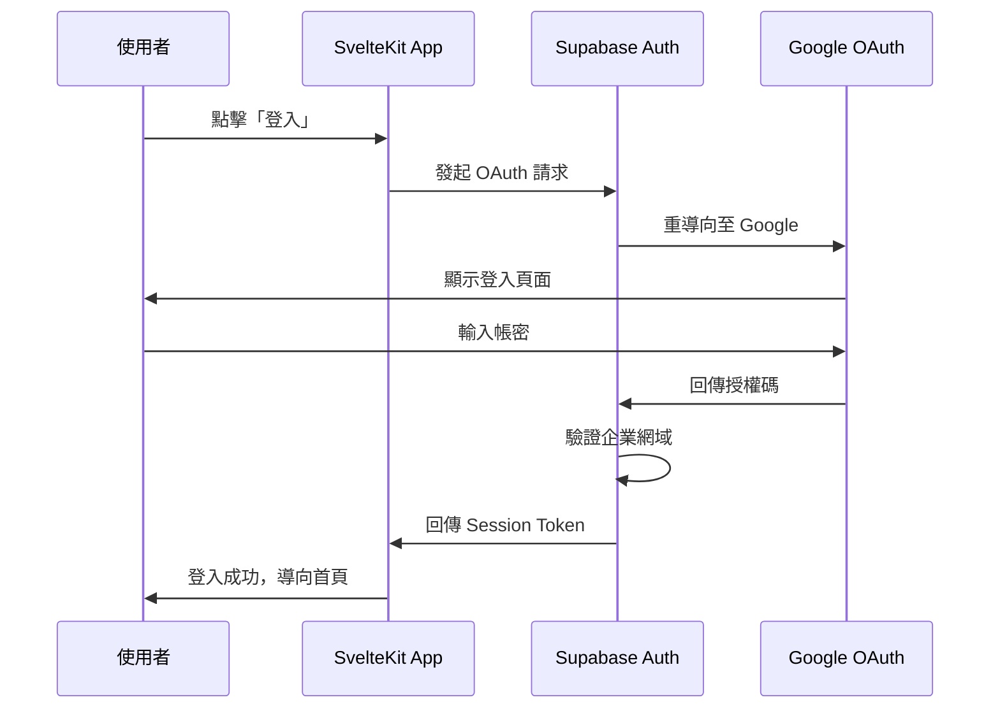
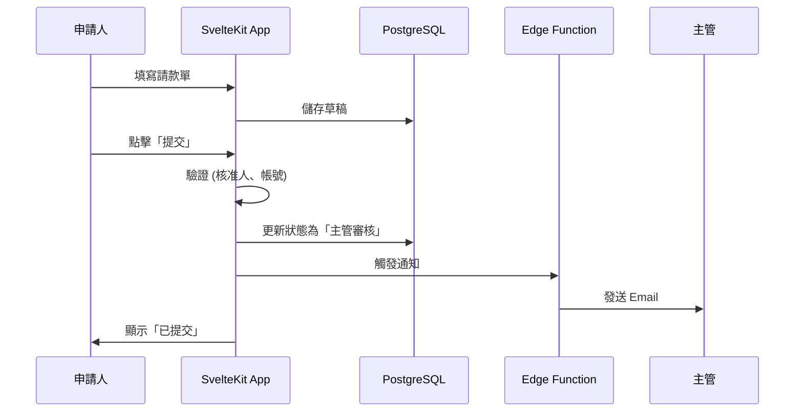
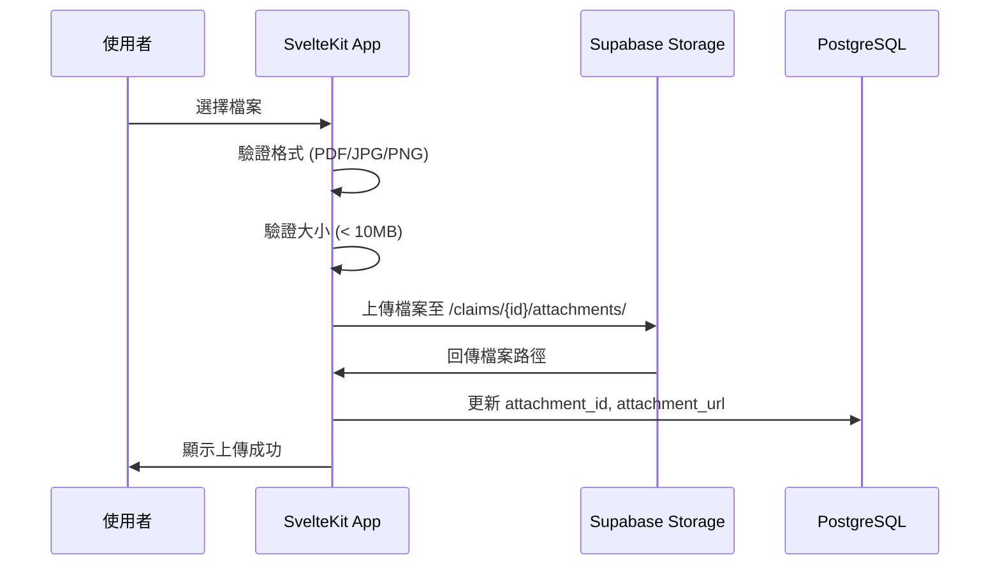

# 02_技術架構與輔助規範

> 彙整文件：技術架構文件、技術決策紀錄 (ADR)、專案結構說明、測試策略文件  
> 最後更新：2026-02-08

---

## 📖 目錄

- [1. 架構概覽](#1-架構概覽)
- [2. 技術棧詳細說明](#2-技術棧詳細說明)
- [3. 資料流程](#3-資料流程)
- [4. 效能最佳化策略](#4-效能最佳化策略)
- [5. 安全性設計](#5-安全性設計)
- [6. 定時任務](#6-定時任務)
- [7. 版本控制與 CI/CD](#7-版本控制與-cicd)
- [8. 環境變數](#8-環境變數)
- [9. 監控與日誌](#9-監控與日誌)
- [10. 技術決策紀錄 (ADR)](#10-技術決策紀錄-adr)
- [11. 專案結構說明](#11-專案結構說明)
- [12. 測試策略](#12-測試策略)

---

## 1. 架構概覽

```
┌─────────────────────────────────────────────────────────────┐
│                         使用者                               │
│                    (瀏覽器 / 行動裝置)                        │
└─────────────────────────────────────────────────────────────┘
                              │
                              ▼
┌─────────────────────────────────────────────────────────────┐
│                    Vercel Edge Network                       │
│              ┌─────────────────────────────┐                │
│              │       SvelteKit App         │                │
│              │  ┌───────────┬───────────┐  │                │
│              │  │  Pages    │ API Routes│  │                │
│              │  │  (SSR)    │ (Server)  │  │                │
│              │  └───────────┴───────────┘  │                │
│              └─────────────────────────────┘                │
└─────────────────────────────────────────────────────────────┘
                              │
                              ▼
┌─────────────────────────────────────────────────────────────┐
│                        Supabase                              │
│  ┌──────────┐  ┌──────────┐  ┌──────────┐  ┌──────────┐    │
│  │PostgreSQL│  │   Auth   │  │ Storage  │  │ Realtime │    │
│  │ Database │  │(Google   │  │(憑證檔案) │  │(即時推送)│    │
│  │          │  │ OAuth)   │  │          │  │          │    │
│  └──────────┘  └──────────┘  └──────────┘  └──────────┘    │
│                                                              │
│              ┌─────────────────────────────┐                │
│              │      Edge Functions         │                │
│              │  (Email 通知、背景任務)      │                │
│              └─────────────────────────────┘                │
└─────────────────────────────────────────────────────────────┘
                              │
                              ▼
┌─────────────────────────────────────────────────────────────┐
│                  Google Workspace                            │
│              ┌─────────────────────────────┐                │
│              │      SMTP (Email 發送)       │                │
│              └─────────────────────────────┘                │
└─────────────────────────────────────────────────────────────┘
```

---

## 2. 技術棧詳細說明

### 2.1 前端 / 全端框架：SvelteKit

| 項目 | 說明 |
|-----|------|
| **框架版本** | SvelteKit 2.x |
| **語言** | TypeScript |
| **樣式** | Tailwind CSS |
| **UI 元件庫** | shadcn-svelte |
| **特性** | 編譯型框架，無 Virtual DOM，極致效能 |

**UI 元件庫 (shadcn-svelte)**：
- 基於 Tailwind CSS 的可複製元件庫
- 包含 Button, Input, Select, Table, Dialog, Toast 等 40+ 元件
- 元件複製到專案內，可完全客製化
- 安裝方式：`npx shadcn-svelte@latest init`

**關鍵技術實踐**：
- **Link Prefetching**：滑鼠移至連結時預載資料，實現「零延遲」導航
- **Optimistic UI**：儲存操作先更新畫面，不等 API 回應
- **Server Actions**：商務邏輯於伺服器端執行，安全且效能佳
- **Form Actions**：原生表單提交，無需額外前端狀態管理

### 2.2 基礎設施：Supabase

| 服務 | 用途 | 備註 |
|-----|------|------|
| **PostgreSQL** | 主要資料庫 | 支援 JSONB、原子事務 |
| **Auth** | 使用者認證 | Google OAuth 2.0 + 企業網域限制 |
| **Storage** | 憑證檔案存放 | Signed URL 存取控制 |
| **Realtime** | 即時資料推送 | 狀態變更即時通知 |
| **Edge Functions** | 背景任務 | Email 發送、檔案清理 |

### 2.3 部署平台：Vercel

| 項目 | 說明 |
|-----|------|
| **部署方式** | GitHub 主分支 Push 自動部署 |
| **Edge Network** | 全球 CDN 加速 |
| **Cron Jobs** | 定時任務執行 (每週清理孤立檔案) |
| **環境變數** | Supabase URL、API Key、SMTP 設定 |

### 2.4 Email 通知：Google Workspace SMTP

| 項目 | 說明 |
|-----|------|
| **發送帳號** | noreply@company.com |
| **每日限額** | 2,000 封 (Workspace 帳號) |
| **觸發方式** | Supabase Edge Functions 呼叫 |

### 2.5 測試架構 (Testing Stack)

| 服務 | 用途 | 備註 |
|-----|------|------|
| **Vitest** | 單元測試 (Unit Test) | 針對工具函數與 Svelte 組件邏輯 |
| **Playwright** | 端對端測試 (E2E) | 模擬瀏覽器行為、驗證關鍵流程 |
| **jsdom** | 瀏覽器環境模擬 | 供 Vitest 在 Node.js 中執行網頁邏輯 |

---

## 3. 資料流程

### 3.1 使用者認證流程



### 3.2 請款單提交流程



### 3.3 憑證上傳流程



---

## 4. 效能最佳化策略

| 策略 | 實作方式 | 預期效果 |
|-----|---------|---------| 
| **頁面預載** | SvelteKit Link Prefetching | 導航 < 100ms |
| **樂觀更新** | Optimistic UI Pattern | 儲存感覺即時 |
| **連線池** | Supabase 管理 | 無冷啟動延遲 |
| **圖片優化** | 憑證壓縮 + WebP | 載入更快 |
| **快取策略** | Vercel Edge Cache | 靜態資源極速 |

---

## 5. 安全性設計

### 5.1 認證與授權

| 層級 | 機制 |
|-----|------|
| **認證** | Supabase Auth + Google OAuth 2.0 |
| **企業限制** | 僅允許 @company.com 網域 |
| **Session** | Supabase 管理，過期自動登出 |
| **RBAC** | 角色權限控制 (申請人/主管/財務/管理員) |

### 5.2 資料安全

| 項目 | 機制 |
|-----|------|
| **傳輸加密** | HTTPS (Vercel 自動) |
| **靜態加密** | PostgreSQL 欄位加密 (銀行帳號、身分證) |
| **檔案存取** | Supabase Signed URL (有時效) |
| **RLS** | Row Level Security (僅存取自己的資料) |

---

## 6. 定時任務

| 任務 | 排程 | 執行方式 |
|-----|------|---------| 
| **清理孤立憑證** | 每週日 03:00 | Vercel Cron → API Route → Supabase |

**vercel.json 設定範例**：
```json
{
  "crons": [
    {
      "path": "/api/cron/cleanup-orphan-files",
      "schedule": "0 3 * * 0"
    }
  ]
}
```

---

## 7. 版本控制與 CI/CD

| 項目 | 工具 | 說明 |
|-----|------|------|
| **程式碼託管** | GitHub | 主分支保護，需 PR Review |
| **自動部署** | Vercel | Push 後自動建置部署 |
| **環境分離** | Vercel Preview | PR 建立時自動產生預覽環境 |

**分支策略**：
```
main (生產環境)
  └── develop (開發環境)
       └── feature/* (功能分支)
```

---

## 8. 環境變數

| 變數名稱 | 說明 | 範例 |
|---------|------|------| 
| `PUBLIC_SUPABASE_URL` | Supabase 專案 URL | https://xxx.supabase.co |
| `PUBLIC_SUPABASE_ANON_KEY` | Supabase 公開金鑰 | eyJhbGciOiJIUzI1NiIs... |
| `SUPABASE_SERVICE_ROLE_KEY` | Supabase 服務金鑰 (Server 端) | eyJhbGciOiJIUzI1NiIs... |
| `SMTP_HOST` | SMTP 主機 | smtp.gmail.com |
| `SMTP_USER` | SMTP 帳號 | noreply@company.com |
| `SMTP_PASS` | SMTP App Password | xxxx-xxxx-xxxx-xxxx |

---

## 9. 監控與日誌

| 項目 | 工具 | 說明 |
|-----|------|------|
| **應用程式日誌** | Vercel Logs | 即時查看 API 錯誤 |
| **資料庫監控** | Supabase Dashboard | 查詢效能、連線數 |
| **錯誤追蹤** | (建議) Sentry | 前端錯誤捕捉 (可選) |

---

## 10. 技術決策紀錄 (ADR)

這份文件記錄了本專案所有的關鍵技術決策，幫助未來繼接者理解「為什麼」選用這些工具。

### [ADR-001] 測試框架選擇 (Vitest & Playwright)

* **狀態**：已採納 (2026-02-08)
* **背景**：專案需要單元測試與端對端測試以保證質量。
* **決策**：
  - 單元測試選用 **Vitest**：與 SvelteKit 的 Vite 底層完美整合，速度極快。
  - 端對端測試選用 **Playwright**：比 Cypress 更穩定、多瀏覽器支援更好且配置簡單。
* **影響**：新增了 `vitest.config.ts` 與 `playwright.config.ts`。

### [ADR-002] 認證與授權 (Supabase Auth & RLS)

* **狀態**：已採納 (2026-02-08)
* **背景**：系統需要處理敏感的帳務與員工資料。
* **決策**：
  - 使用 **Supabase SSR**：確保 Server-side 渲染時也能獲得身分。
  - 強制啟用 **Row Level Security (RLS)**：在資料庫層級保護隱私，而非僅依賴後端 API。
  - **Profiles 分離**：將員工詳細資訊存於 `public.profiles`，不直接修改 `auth.users`，以符合安全實務。
  - **簡化架構 (移除部門)**：根據使用者回饋 (2026-02-08)，系統移除 `departments` 層級，簡化為以個人為核心的報銷流程。
* **影響**：所有查詢必須考慮 RLS 政策，且所有連動欄位 (dept_id) 已全數移除，RLS 簡化為僅驗證使用者個人權限。

### [ADR-004] UI 元件庫選擇 (Shadcn UI)

* **狀態**：已採納 (2026-02-08)
* **背景**：需要快速建立專業、一致且高度可自訂的 UI 介面。
* **決策**：選用 **shadcn-svelte**。
* **理由**：
  - 非套件安裝，代碼直接複製到專案，靈活度最高。
  - 基於 Tailwind CSS v4，符合最新前端技術趨勢。
* **影響**：新增 `src/lib/components/ui/` 目錄與 `components.json`。

### [ADR-005] 自動化基礎設施初始化 (Storage Bucket 腳本)

* **狀態**：已採納 (2026-02-08)
* **背景**：手動在 Supabase Console 建立 Bucket 容易遺漏設定（如權限、檔案限制）。
* **決策**：建立 **`init-supabase.ts`** 自動化腳本。
* **理由**：
  - 確保開發、測試與生產環境的 Bucket 設定完全一致。
  - 可程式化控制檔案大小限制與 MIME 類型。
* **影響**：開發流程中需執行一次此腳本。

### [ADR-006] 認證導向策略 (Redirect URIs)

* **狀態**：已採納 (2026-02-08)
* **背景**：Google OAuth 需要明確的 Redirect URI 以防止安全性攻擊。
* **決策**：統一使用 `/auth/callback` 作為信號交換端點。
* **理由**：
  - 集中處理 Code 換 Session 的邏輯。
  - 簡化 Google Cloud Console 的配置清單。
* **影響**：所有 OAuth 請求必須攜帶正確的 `redirectTo` 參數。

### 技術決策記錄 (附錄)

| 決策 | 選擇 | 理由 |
|-----|------|------|
| 全端框架 | SvelteKit (非 Next.js) | 編譯型效能佳、表單操作流暢 |
| 後端架構 | 純 SvelteKit (非 Go) | 減少維運複雜度、內部系統流量可控 |
| Email 服務 | Google SMTP (非 SendGrid) | 已有 Workspace、免費、高送達率 |
| 定時任務 | Vercel Cron (非 pg_cron) | 設定簡單、與部署整合 |

---

## 11. 專案結構說明

> 這份文件說明專案中每個檔案和資料夾的用途，幫助你快速理解 SvelteKit 專案結構。

### 11.1 根目錄結構

```
報銷_new/
├── 📁 src/                    ← 🔴 你的程式碼都在這裡
├── 📁 static/                 ← 靜態檔案 (圖片、favicon)
├── 📁 node_modules/           ← npm 套件 (不用管)
├── 📁 .svelte-kit/            ← 編譯快取 (不用管)
├── 📁 參考文件/                ← 設計文件
│
├── 📁 tests/                  ← 🧪 E2E 測試腳本
│
├── 📄 package.json            ← ⭐ 專案設定檔
├── 📄 svelte.config.js        ← SvelteKit 設定
├── 📄 vite.config.ts          ← Vite 打包工具設定
├── 📄 vitest.config.ts        ← 🧪 單元測試設定
├── 📄 playwright.config.ts    ← 🧪 E2E 測試設定
├── 📄 tsconfig.json           ← TypeScript 設定
├── 📄 components.json         ← shadcn-svelte 設定
│
├── 📄 .env.example            ← 環境變數範本
├── 📄 .gitignore              ← Git 忽略清單
└── 📄 README.md               ← 專案說明
```

### 11.2 src/ (核心程式碼)

```
src/
├── 📄 app.html                ← HTML 模板 (通常不需改)
├── 📄 app.css                 ← 全域 CSS 樣式 (含色彩變數定義)
├── 📄 app.d.ts                ← ⭐ TypeScript 型別定義 (定義全域資料格式)
├── 📄 hooks.server.ts         ← ⭐ 伺服器攔截器 (檢查登入、權限)
│
├── 📁 routes/                 ← ⭐ 頁面和路由
│   ├── 📄 +page.svelte        ← 首頁 (/)
│   ├── 📄 +layout.svelte      ← 共用版面 (所有頁面都會用，含 Sidebar)
│   ├── 📄 +layout.server.ts   ← ⭐ 載入版面資料與路由保護 (RBAC)
│   ├── 📁 auth/               ← 🔑 認證相關路由
│   │   ├── 📄 +page.svelte    ← Google 登入頁面
│   │   └── 📁 callback/       ← OAuth 回傳處理
│   │       └── 📄 +server.ts  ← 處理登入成功後的代碼交換
│
└── 📁 lib/                    ← ⭐ 共用程式碼庫
    ├── 📁 components/         ← 所有 UI 元件
    │   ├── 📁 ui/             ← shadcn-svelte 基礎元件 (16 個)
    │   │   ├── 📁 button/     ← Button 按鈕元件
    │   │   ├── 📁 input/      ← Input 輸入框元件
    │   │   ├── 📁 select/     ← Select 選單元件
    │   │   ├── 📁 textarea/   ← Textarea 多行輸入元件
    │   │   ├── 📁 card/       ← Card 卡片元件
    │   │   ├── 📁 badge/      ← Badge 標籤元件
    │   │   ├── 📁 dialog/     ← Dialog 對話框元件
    │   │   ├── 📁 sonner/     ← Toast 通知元件
    │   │   ├── 📁 table/      ← Table 表格元件
    │   │   ├── 📁 label/      ← Label 標籤元件
    │   │   ├── 📁 separator/  ← Separator 分隔線元件
    │   │   ├── 📁 scroll-area/ ← ScrollArea 滾動區域元件
    │   │   ├── 📁 dropdown-menu/ ← DropdownMenu 下拉選單元件
    │   │   ├── 📁 avatar/     ← Avatar 頭像元件
    │   │   ├── 📁 tooltip/    ← Tooltip 提示元件
    │   │   └── 📁 popover/    ← Popover 彈出框元件
    │   │
    │   ├── 📁 layout/         ← 🆕 佈局元件
    │   │   ├── 📄 Sidebar.svelte      ← 側邊導航 (含 RBAC 過濾)
    │   │   ├── 📄 Breadcrumb.svelte   ← 麵包屑導航
    │   │   ├── 📄 PageLayout.svelte   ← 頁面佈局包裝
    │   │   └── 📄 index.ts            ← 匯出入口
    │   │
    │   ├── 📁 shared/         ← 🆕 共用元件
    │   │   ├── 📄 Loading.svelte      ← 載入中狀態
    │   │   ├── 📄 EmptyState.svelte   ← 空狀態顯示
    │   │   └── 📄 index.ts            ← 匯出入口
    │   │
    │   └── 📁 claims/         ← 🆕 請款專用元件
    │       ├── 📄 StatusBadge.svelte  ← 請款狀態標籤 (9 種狀態對應色彩)
    │       └── 📄 index.ts            ← 匯出入口
    │
    ├── 📁 hooks/              ← 自訂邏輯 Hooks
    ├── 📁 scripts/            ← 🛠️ 自動化腳本 (如：`init-supabase.ts`)
    ├── 📁 assets/             ← 資源檔案
    ├── 📄 index.ts            ← ⭐ lib 集中匯出入口 (所有外部引用應透過此檔)
    ├── 📄 supabase.ts         ← ⭐ Supabase 用戶端設定
    └── 📄 utils.ts            ← 通用工具函數 (如格式化、cn())
```

### 11.3 tests/ (測試腳本)

```
tests/
├── 📄 auth.e2e.ts             ← 認證流程 E2E 測試
└── 📄 rls.spec.ts              ← ⭐ RLS 安全性驗證測試 (驗證資料隔離)
```

### 11.4 重要檔案詳解

#### `package.json` ⭐
**用途**：專案的「身分證」，記錄：
- 專案名稱、版本
- 使用的套件 (dependencies)
- 可執行的指令 (scripts)

**常用指令**：
```bash
npm run dev      # 啟動開發伺服器
npm run build    # 打包成正式版
npm run preview  # 預覽正式版
```

#### `src/routes/+page.svelte`
**用途**：首頁內容

**規則**：
- `routes/` 資料夾結構 = 網址結構
- `+page.svelte` = 頁面內容
- `+layout.svelte` = 共用版面

**範例**：
```
src/routes/
├── +page.svelte              → /
├── auth/
│   └── +page.svelte          → /auth (Google 登入)
├── claims/
│   ├── +page.svelte          → /claims
│   └── [id]/
│       └── +page.svelte      → /claims/123 (動態路由)
```

#### `src/routes/+layout.svelte`
**用途**：所有頁面共用的外框（如導覽列、頁尾）

**範例**：
```svelte
<script lang="ts">
  import "../app.css";
  import { page } from "$app/state"; // Svelte 5 新語法
  let { data, children } = $props(); // Svelte 5 Snippets
</script>

{#if data.session}
  <Sidebar user={data.user} />
  <main>
    {@render children()}
  </main>
{:else}
  {@render children()}
{/if}
```

#### `src/lib/` (用 `$lib` 引入)
**用途**：存放可重複使用的程式碼

**引入方式**：
```svelte
<script>
  // ❌ 不要這樣寫
  import Button from '../../../lib/components/ui/button';
  
  // ✅ 用 $lib 別名
  import { Button } from '$lib/components/ui/button';
</script>
```

#### `src/hooks.server.ts` ⭐
**用途**：伺服器端的「管理員」。
- 每當有頁面請求時都會先經過這裡。
- 用來檢查使用者登入狀態、保護後台路由。

#### `src/lib/supabase.ts` ⭐
**用途**：設定 SvelteKit 與 Supabase 的連線工廠。
- 建立連線用的 Client 物件。
- 處理 Cookie 與 Session (登入狀態) 的同步。

#### `src/lib/scripts/init-supabase.ts` 🛠️
**用途**：環境初始化腳本。
- 自動建立專案所需的 Storage Buckets (如：receipts)。
- 使用 Service Role Key 執行高權限操作。

#### `src/routes/auth/callback/+server.ts` 🔑
**用途**：OAuth 驗證回傳處理器。
- 接收 Google 登入成功後回傳的代碼 (code)。
- 將代碼交換成正式的使用者 Session 並導回首頁。

#### `.env` (及 `.env.example`)
**用途**：環境變數（存放密鑰與連線資訊）

**目前包含**：
- `PUBLIC_SUPABASE_URL`: Supabase 網址
- `PUBLIC_SUPABASE_ANON_KEY`: 公開金鑰
- `SUPABASE_SERVICE_ROLE_KEY`: **機密金鑰** (不可外流)
- `PUBLIC_APP_ENV`: 環境標記 (如 development)

**注意**：
- `.env` 包含真實密鑰，**絕對不能上傳 Git**。
- `.env.example` 是乾淨的範本，可以上傳。

### 11.5 SvelteKit 路由規則速查

| 檔案名稱 | 用途 |
|----------|------|
| `+page.svelte` | 頁面內容 |
| `+page.ts` | 頁面載入資料 (client) |
| `+page.server.ts` | 頁面載入資料 (server only) |
| `+layout.svelte` | 共用版面 |
| `+layout.ts` | 版面載入資料 |
| `+error.svelte` | 錯誤頁面 |
| `+server.ts` | API 端點 |

### 11.6 開發時常用路徑

| 你想做什麼 | 去哪裡 |
|------------|--------|
| 新增頁面 | `src/routes/` |
| 修改共用版面 | `src/routes/+layout.svelte` |
| 新增/修改 UI 元件 | `src/lib/components/` |
| 新增工具函數 | `src/lib/utils.ts` |
| 修改全域樣式 | `src/app.css` |
| 設定環境變數 | `.env` |

### 11.7 不需要管的資料夾

| 資料夾 | 說明 |
|--------|------|
| `node_modules/` | npm 套件，自動生成 |
| `.svelte-kit/` | 編譯快取，自動生成 |
| `.git/` | Git 版本控制資料 |

---

## 12. 測試策略

### 12.1 測試架構總覽

```
┌─────────────────────────────────────────────────────────────────┐
│                         測試金字塔                               │
├─────────────────────────────────────────────────────────────────┤
│                                                                 │
│                        ┌─────────┐                              │
│                        │   E2E   │  ← Playwright (關鍵流程)     │
│                        └────┬────┘                              │
│                      ┌──────┴──────┐                            │
│                      │  整合測試   │  ← Vitest (API + DB)       │
│                      └──────┬──────┘                            │
│                 ┌───────────┴───────────┐                       │
│                 │       單元測試         │  ← Vitest (函數)      │
│                 └───────────────────────┘                       │
│                                                                 │
│  底層測試多、快速執行 → 上層測試少、驗證完整流程                   │
└─────────────────────────────────────────────────────────────────┘
```

### 12.2 測試工具選擇

| 層級 | 工具 | 用途 |
|------|------|------|
| **單元測試** | Vitest | 測試工具函數、計算邏輯 |
| **整合測試** | Vitest + Supertest | 測試 API 端點 |
| **端對端測試** | Playwright | 模擬使用者操作瀏覽器 |
| **覆蓋率報告** | c8 (內建) | 計算程式碼覆蓋率 |

### 12.3 設定檔範例

#### 安裝依賴
```bash
npm install -D vitest @testing-library/svelte jsdom playwright @playwright/test
```

#### vitest.config.ts
```typescript
import { defineConfig } from 'vitest/config';
import { sveltekit } from '@sveltejs/kit/vite';

export default defineConfig({
  plugins: [sveltekit()],
  test: {
    include: ['src/**/*.{test,spec}.{js,ts}'],
    environment: 'jsdom',
    globals: true,
    coverage: {
      reporter: ['text', 'html'],
      exclude: ['node_modules/', 'tests/']
    }
  }
});
```

#### playwright.config.ts
```typescript
import { defineConfig, devices } from '@playwright/test';

export default defineConfig({
  testDir: './tests',
  fullyParallel: true,
  forbidOnly: !!process.env.CI,
  retries: process.env.CI ? 2 : 0,
  workers: process.env.CI ? 1 : undefined,
  reporter: 'html',
  use: {
    baseURL: 'http://localhost:5173',
    trace: 'on-first-retry',
  },
  projects: [
    {
      name: 'chromium',
      use: { ...devices['Desktop Chrome'] },
    },
  ],
  webServer: {
    command: 'npm run dev',
    url: 'http://localhost:5173',
    reuseExistingServer: !process.env.CI,
  },
});
```

#### package.json scripts
```json
{
  "scripts": {
    "test:unit": "vitest",
    "test:run": "vitest run",
    "test:coverage": "vitest run --coverage",
    "test:e2e": "playwright test",
    "test:e2e:ui": "playwright test --ui"
  }
}
```

### 12.4 測試案例規劃

#### 單元測試 (Vitest)

| 模組 | 測試項目 | 優先級 |
|------|----------|:------:|
| **金額計算** | `calculateTotal()` 正確加總 | 高 |
| **金額計算** | 處理空陣列 | 高 |
| **金額計算** | 處理負數（應拒絕） | 高 |
| **發票驗證** | `validateInvoiceNumber()` 格式正確 | 高 |
| **發票驗證** | 格式錯誤回傳 false | 高 |
| **狀態機** | `getNextStatus()` 轉換正確 | 高 |
| **狀態機** | 非法轉換拋出錯誤 | 中 |

**範例**：
```typescript
// src/lib/utils/calculate.test.ts
import { describe, it, expect } from 'vitest';
import { calculateTotal } from './calculate';

describe('calculateTotal', () => {
  it('should sum all amounts correctly', () => {
    expect(calculateTotal([100, 200, 300])).toBe(600);
  });

  it('should return 0 for empty array', () => {
    expect(calculateTotal([])).toBe(0);
  });

  it('should throw error for negative amounts', () => {
    expect(() => calculateTotal([-100])).toThrow();
  });
});
```

#### 端對端測試 (Playwright)

| 流程 | 測試項目 | 優先級 |
|------|----------|:------:|
| **登入** | Google OAuth 登入成功 | 高 |
| **登入** | 未登入導向登入頁 | 高 |
| **請款** | 新增員工報銷 → 儲存草稿 | 高 |
| **請款** | 新增廠商請款 → 提交 | 高 |
| **審核** | 主管核准流程 | 高 |
| **審核** | 財務駁回流程 | 中 |
| **付款** | 單筆付款完成 | 高 |
| **付款** | 批次付款 | 中 |

**範例**：
```typescript
// tests/claims.spec.ts
import { test, expect } from '@playwright/test';

test.describe('請款單流程', () => {
  test.beforeEach(async ({ page }) => {
    // 登入（使用測試帳號）
    await page.goto('/auth/login');
    // ... 登入邏輯
  });

  test('新增員工報銷並儲存草稿', async ({ page }) => {
    await page.goto('/claims/new?type=employee');
    
    // 填寫表單
    await page.fill('[data-testid="description"]', '測試報銷');
    await page.fill('[data-testid="item-amount-0"]', '1000');
    await page.selectOption('[data-testid="item-category-0"]', '交通費');
    
    // 儲存草稿
    await page.click('[data-testid="save-draft"]');
    
    // 驗證
    await expect(page.locator('.toast-success')).toBeVisible();
    await expect(page).toHaveURL(/\/claims\/[a-z0-9-]+/);
  });

  test('提交請款單需要核准人', async ({ page }) => {
    await page.goto('/claims/new?type=employee');
    
    // 填寫並提交
    await page.fill('[data-testid="description"]', '測試');
    await page.fill('[data-testid="item-amount-0"]', '500');
    await page.click('[data-testid="submit"]');
    
    // 應該看到錯誤訊息（如果沒設定核准人）
    await expect(page.locator('.error-message')).toContainText('核准人');
  });
});
```

### 12.5 測試執行策略

#### 開發時
```bash
# 監聽模式，修改後自動執行
npm run test:unit
```

#### 提交前
```bash
# 執行所有單元測試 (僅執行一次)
npm run test:run

# 執行 E2E 測試
npm run test:e2e
```

#### CI/CD (GitHub Actions)
```yaml
# .github/workflows/test.yml
name: Test

on: [push, pull_request]

jobs:
  test:
    runs-on: ubuntu-latest
    steps:
      - uses: actions/checkout@v4
      - uses: actions/setup-node@v4
        with:
          node-version: '20'
      
      - run: npm ci
      
      - name: Run unit tests
        run: npm run test:run
      
      - name: Run E2E tests
        run: npx playwright install && npm run test:e2e
```

### 12.6 覆蓋率目標

| 層級 | 目標覆蓋率 | 說明 |
|------|:----------:|------|
| 單元測試 | 80% | 核心邏輯必須覆蓋 |
| 整合測試 | 60% | API 主要路徑 |
| E2E 測試 | - | 覆蓋核心使用者流程 |

### 12.7 回歸測試清單

每次發布前，確認以下核心流程正常：

#### 認證
- [ ] Google 登入成功
- [ ] 登出後導向登入頁

#### 請款
- [ ] 新增員工報銷
- [ ] 新增廠商請款
- [ ] 新增個人勞務
- [ ] 儲存草稿
- [ ] 提交請款單
- [ ] 上傳憑證

#### 審核
- [ ] 主管核准
- [ ] 主管駁回
- [ ] 財務核准
- [ ] 財務駁回

#### 付款
- [ ] 單筆付款
- [ ] 批次付款
- [ ] 取消付款

---

> 📚 如有疑問，可以查閱 [SvelteKit 官方文件](https://kit.svelte.dev/docs)

> 💡 **使用方式**：專案初始化時，依照本文件設定測試環境。開發新功能時，同步撰寫對應的測試案例。
