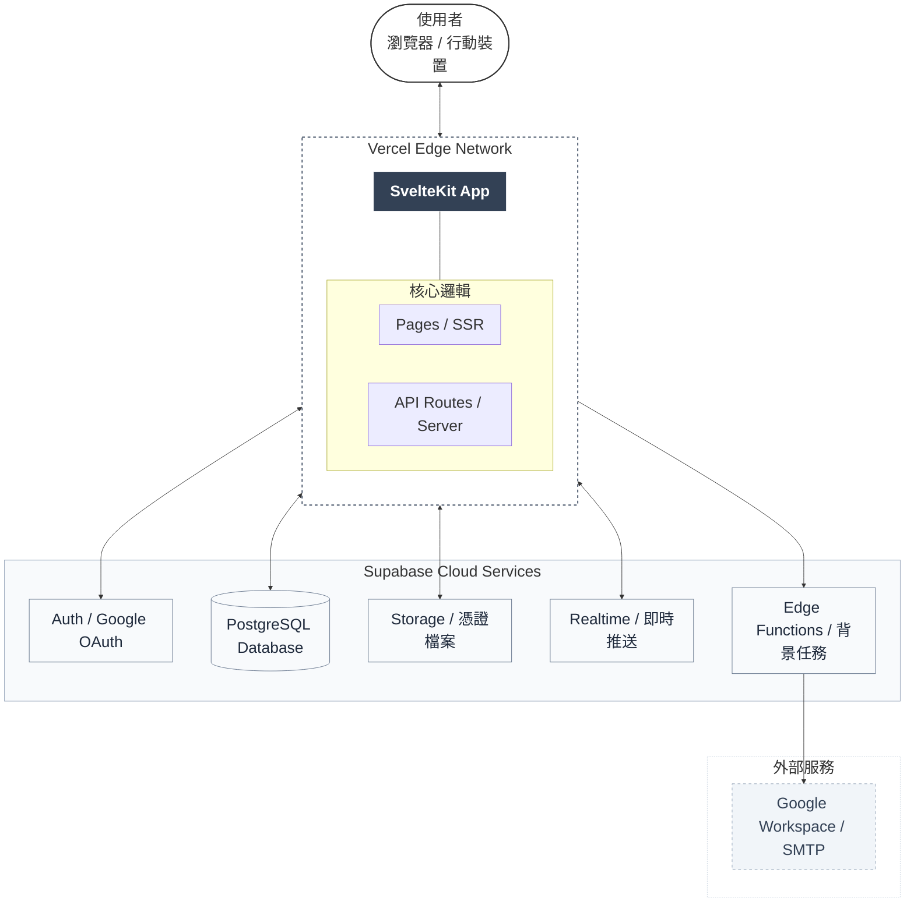
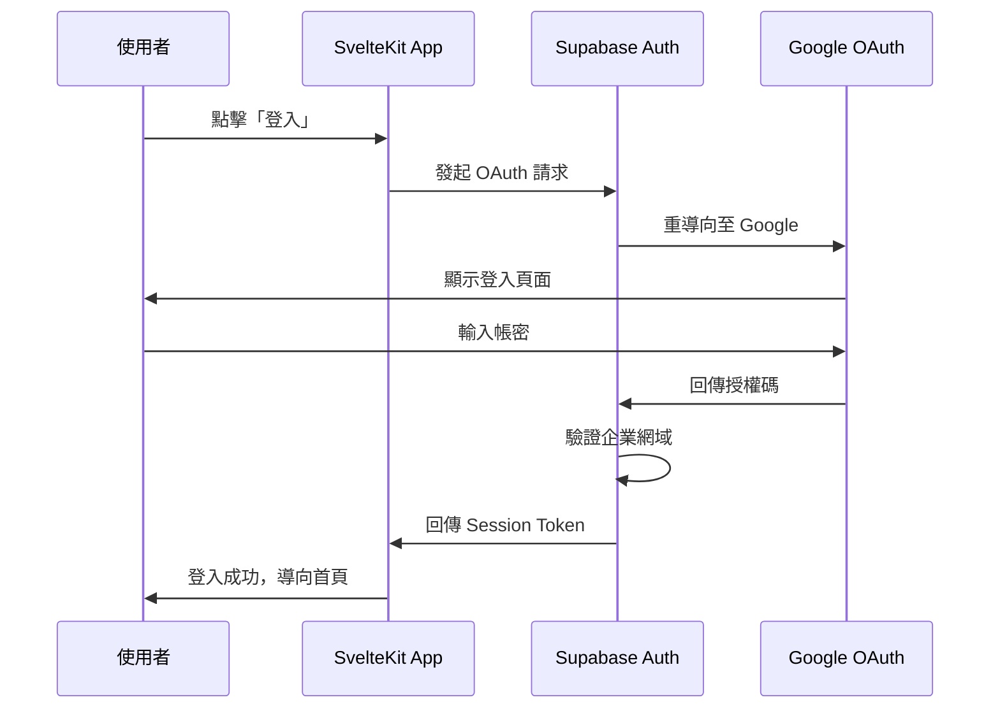
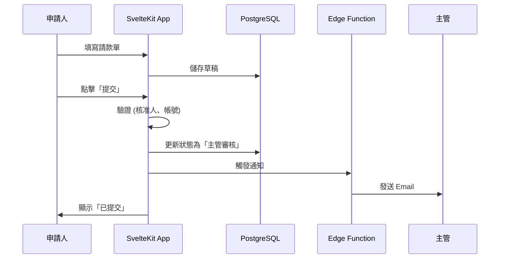

# 02_技術架構與輔助規範

> 彙整文件：技術架構文件、技術決策紀錄 (ADR)、專案結構說明、測試策略文件  
> 最後更新：2026-02-11

---

## 📖 目錄

- [1. 架構概覽](#1-架構概覽)
- [2. 技術棧詳細說明](#2-技術棧詳細說明)
- [3. 資料流程](#3-資料流程)
- [4. 效能最佳化策略](#4-效能最佳化策略)
- [5. 安全性設計](#5-安全性設計)
- [6. 定時任務](#6-定時任務)
- [7. 版本控制與 CI/CD](#7-版本控制與-cicd)
- [8. 環境變數](#8-環境變數)
- [9. 監控與日誌](#9-監控與日誌)
- [10. 技術決策紀錄 (ADR)](#10-技術決策紀錄-adr)
- [11. 專案結構說明](#11-專案結構說明)
- [12. 測試策略](#12-測試策略)

---

## 1. 架構概覽



---

## 2. 技術棧詳細說明

### 2.1 前端 / 全端框架：SvelteKit

| 項目 | 說明 |
|-----|------|
| **框架版本** | SvelteKit 2.x |
| **語言** | TypeScript |
| **樣式** | Tailwind CSS |
| **UI 元件庫** | shadcn-svelte |
| **特性** | 編譯型框架，無 Virtual DOM，極致效能 |

**UI 元件庫 (shadcn-svelte)**：
- 基於 Tailwind CSS 的可複製元件庫
- 包含 Button, Input, Select, Table, Dialog, Toast 等 40+ 元件
- 元件複製到專案內，可完全客製化
- 安裝方式：`npx shadcn-svelte@latest init`

**關鍵技術實踐**：
- **Link Prefetching**：滑鼠移至連結時預載資料，實現「零延遲」導航
- **Optimistic UI**：儲存操作先更新畫面，不等 API 回應
- **Server Actions**：商務邏輯於伺服器端執行，安全且效能佳
- **Form Actions**：原生表單提交，無需額外前端狀態管理

### 2.2 基礎設施：Supabase

| 服務 | 用途 | 備註 |
|-----|------|------|
| **PostgreSQL** | 主要資料庫 | 支援 JSONB、原子事務 |
| **Auth** | 使用者認證 | Google OAuth 2.0 + 企業網域限制 |
| **Storage** | 憑證檔案存放 | Signed URL 存取控制 |
| **Realtime** | 即時資料推送 | 狀態變更即時通知 |
| **Edge Functions** | 背景任務 | Email 發送、檔案清理 |

### 2.3 部署平台：Vercel

| 項目 | 說明 |
|-----|------|
| **部署方式** | GitHub 主分支 Push 自動部署 |
| **Edge Network** | 全球 CDN 加速 |
| **Cron Jobs** | 定時任務執行 (每週清理孤立檔案) |
| **環境變數** | Supabase URL、API Key、SMTP 設定 |

### 2.4 Email 通知：Google Workspace SMTP

| 項目 | 說明 |
|-----|------|
| **發送帳號** | noreply@company.com |
| **每日限額** | 2,000 封 (Workspace 帳號) |
| **觸發方式** | Supabase Edge Functions 呼叫 |

### 2.5 測試架構 (Testing Stack)

| 服務 | 用途 | 備註 |
|-----|------|------|
| **Vitest** | 單元測試 (Unit Test) | 針對工具函數與 Svelte 組件邏輯 |
| **Playwright** | 端對端測試 (E2E) | 模擬瀏覽器行為、驗證關鍵流程 |
| **jsdom** | 瀏覽器環境模擬 | 供 Vitest 在 Node.js 中執行網頁邏輯 |

---

## 3. 資料流程

### 3.1 使用者認證流程



### 3.2 請款單提交流程



### 3.3 憑證上傳流程

```mermaid
sequenceDiagram
    participant U as 使用者
    participant A as SvelteKit App
    participant S as Supabase Storage
    participant D as PostgreSQL

    U->>A: 選擇檔案
    A->>A: 驗證格式 (PDF/JPG/PNG)
    A->>A: 驗證大小 (< 10MB)
    A->>S: 上傳檔案至 /claims/{id}/attachments/
    S->>A: 回傳檔案路徑
    A->>D: 更新 attachment_id, attachment_url
    A->>U: 顯示上傳成功

### 3.4 收款人管理流程

```mermaid
sequenceDiagram
    participant U as 一般使用者
    participant F as 財務人員
    participant A as SvelteKit App
    participant D as PostgreSQL (RPC)

    U->>A: 提交新增/修改受款人
    A->>D: 呼叫 submit_payee_change_request (加密敏感資料)
    D->>D: 儲存至 payee_change_requests (status: pending)
    A->>U: 顯示「審核中」
    
    F->>A: 查看待審核清單
    F->>A: 核准申請
    A->>D: 呼叫 approve_payee_change_request
    D->>D: 解密資料 -> 寫入 payees 表 -> 更新 request status
    A->>F: 顯示「已核准」
```
```

---

## 4. 效能最佳化策略

| 策略 | 實作方式 | 目前狀態 |
|-----|---------|---------|
| **頁面預載** | `app.html` 全域 preload + Sidebar 主要連結 prefetch | ✅ 已上線 |
| **樂觀更新** | Admin Users 權限管理採 optimistic update + rollback | ✅ 已上線 |
| **圖片優化** | 前端壓縮 helper（收款人附件 + 請款憑證） | ✅ 已上線 |
| **API 響應觀測** | `hooks.server.ts` 注入 `x-response-time`、`server-timing`；client `timedFetch` 紀錄耗時 | ✅ 已上線 |
| **連線池** | Supabase 管理 | ✅ 持續使用 |
| **快取策略** | Vercel Edge / 靜態資源快取 | ✅ 持續使用 |

---

## 5. 安全性設計

### 5.1 認證與授權

| 層級 | 機制 |
|-----|------|
| **認證** | Supabase Auth + Google OAuth 2.0 |
| **企業限制** | 僅允許 @company.com 網域 |
| **Session** | Supabase 管理，過期自動登出 |
| **RBAC** | 角色權限控制 (申請人/主管/財務/管理員) |

### 5.2 資料安全

| 項目 | 機制 |
|-----|------|
| **傳輸加密** | HTTPS (Vercel 自動) |
| **AES-256 加密** | 銀行帳號經 PGP 對稱加密儲存，金鑰隔離於 `system_config` |
| **安全 RPC** | 使用 `SECURITY DEFINER` 函數實作權限檢查 (本人/管理員) |
| **RLS** | Row Level Security (僅存取自己的資料) |
| **OAuth Redirect 安全** | `auth/callback` 僅接受內部相對路徑 (`/xxx`)，拒絕 `//` 與外部導向 |
| **Storage 權限強化** | `payees` bucket 僅允許檔案 owner 或財務/管理員讀寫/刪除 |
| **pgcrypto 相容層** | `public.pgp_sym_encrypt/decrypt` wrapper 轉呼叫 `extensions.pgp_sym_*`，避免 `search_path` 限制造成 RPC 失效 |

---

## 6. 定時任務

| 任務 | 排程 | 執行方式 |
|-----|------|---------| 
| **清理孤立憑證** | 每週日 03:00 | Vercel Cron → API Route → Supabase |

**vercel.json 設定範例**：
```json
{
  "crons": [
    {
      "path": "/api/cron/cleanup-orphan-files",
      "schedule": "0 3 * * 0"
    }
  ]
}
```

---

## 7. 版本控制與 CI/CD

| 項目 | 工具 | 說明 |
|-----|------|------|
| **程式碼託管** | GitHub | 主分支保護，需 PR Review |
| **自動部署** | Vercel | Push 後自動建置部署 |
| **環境分離** | Vercel Preview | PR 建立時自動產生預覽環境 |

**分支策略**：
```
main (生產環境)
  └── develop (開發環境)
       └── feature/* (功能分支)
```

---

## 8. 環境變數

| 變數名稱 | 說明 | 範例 |
|---------|------|------| 
| `PUBLIC_SUPABASE_URL` | Supabase 專案 URL | https://xxx.supabase.co |
| `PUBLIC_SUPABASE_ANON_KEY` | Supabase 公開金鑰 | eyJhbGciOiJIUzI1NiIs... |
| `SUPABASE_SERVICE_ROLE_KEY` | Supabase 服務金鑰 (Server 端) | eyJhbGciOiJIUzI1NiIs... |
| `SMTP_HOST` | SMTP 主機 | smtp.gmail.com |
| `SMTP_USER` | SMTP 帳號 | noreply@company.com |
| `SMTP_PASS` | SMTP App Password | xxxx-xxxx-xxxx-xxxx |

---

## 9. 監控與日誌

| 項目 | 工具 | 說明 |
|-----|------|------|
| **應用程式日誌** | Vercel Logs | 即時查看 API 錯誤 |
| **資料庫監控** | Supabase Dashboard | 查詢效能、連線數 |
| **錯誤追蹤** | (建議) Sentry | 前端錯誤捕捉 (可選) |

---

## 10. 技術決策紀錄 (ADR)

這份文件記錄了本專案所有的關鍵技術決策，幫助未來繼接者理解「為什麼」選用這些工具。

### [ADR-001] 測試框架選擇 (Vitest & Playwright)

* **狀態**：已採納 (2026-02-08)
* **背景**：專案需要單元測試與端對端測試以保證質量。
* **決策**：
  - 單元測試選用 **Vitest**：與 SvelteKit 的 Vite 底層完美整合，速度極快。
  - 端對端測試選用 **Playwright**：比 Cypress 更穩定、多瀏覽器支援更好且配置簡單。
* **影響**：新增了 `vitest.config.ts` 與 `playwright.config.ts`。

### [ADR-002] 認證與授權 (Supabase Auth & RLS)

* **狀態**：已採納 (2026-02-08)
* **背景**：系統需要處理敏感的帳務與員工資料。
* **決策**：
  - 使用 **Supabase SSR**：確保 Server-side 渲染時也能獲得身分。
  - 強制啟用 **Row Level Security (RLS)**：在資料庫層級保護隱私，而非僅依賴後端 API。
  - **Profiles 分離**：將員工詳細資訊存於 `public.profiles`，不直接修改 `auth.users`，以符合安全實務。
  - **簡化架構 (移除部門)**：根據使用者回饋 (2026-02-08)，系統移除 `departments` 層級，簡化為以個人為核心的報銷流程。
* **影響**：所有查詢必須考慮 RLS 政策，且所有連動欄位 (dept_id) 已全數移除，RLS 簡化為僅驗證使用者個人權限。

### [ADR-004] UI 元件庫選擇 (Shadcn UI)

* **狀態**：已採納 (2026-02-08)
* **背景**：需要快速建立專業、一致且高度可自訂的 UI 介面。
* **決策**：選用 **shadcn-svelte**。
* **理由**：
  - 非套件安裝，代碼直接複製到專案，靈活度最高。
  - 基於 Tailwind CSS v4，符合最新前端技術趨勢。
* **影響**：新增 `src/lib/components/ui/` 目錄與 `components.json`。

### [ADR-005] 自動化基礎設施初始化 (Storage Bucket 腳本)

* **狀態**：已採納 (2026-02-08)
* **背景**：手動在 Supabase Console 建立 Bucket 容易遺漏設定（如權限、檔案限制）。
* **決策**：建立 **`init-supabase.ts`** 自動化腳本。
* **理由**：
  - 確保開發、測試與生產環境的 Bucket 設定完全一致。
  - 可程式化控制檔案大小限制與 MIME 類型。
* **影響**：開發流程中需執行一次此腳本。

### [ADR-006] 認證導向策略 (Redirect URIs)

* **狀態**：已採納 (2026-02-08)
* **背景**：Google OAuth 需要明確的 Redirect URI 以防止安全性攻擊。
* **決策**：統一使用 `/auth/callback` 作為信號交換端點。
* **理由**：
  - 集中處理 Code 換 Session 的邏輯。
  - 簡化 Google Cloud Console 的配置清單。
* **影響**：所有 OAuth 請求必須攜帶正確的 `redirectTo` 參數。

### [ADR-007] 2026-02 安全硬化與相容性修補

* **狀態**：已採納 (2026-02-11)
* **背景**：
  - OAuth callback 若直接使用未過濾 `next` 參數，存在 Open Redirect 風險。
  - Storage `payees` bucket 早期策略過寬，可能讓一般登入者讀取不應讀取的附件。
  - 啟用 `SECURITY DEFINER + search_path=public` 後，`pgp_sym_encrypt/decrypt` 可能找不到 `extensions` schema 函數。
* **決策**：
  - callback 僅允許站內安全相對路徑。
  - 強化 `payees` bucket policy：限制為 owner 或財務/管理員。
  - 建立 `public.pgp_sym_encrypt/decrypt` wrapper，統一轉呼叫 `extensions.pgp_sym_*`。
* **影響**：
  - 登入導向更安全，且保留 `next` 回跳能力。
  - 收款人附件隱私邊界更清楚。
  - 既有 claims/payees 加密 RPC 在 hardened `search_path` 下維持可用。

### 技術決策記錄 (附錄)

| 決策 | 選擇 | 理由 |
|-----|------|------|
| 全端框架 | SvelteKit (非 Next.js) | 編譯型效能佳、表單操作流暢 |
| 後端架構 | 純 SvelteKit (非 Go) | 減少維運複雜度、內部系統流量可控 |
| Email 服務 | Google SMTP (非 SendGrid) | 已有 Workspace、免費、高送達率 |
| 定時任務 | Vercel Cron (非 pg_cron) | 設定簡單、與部署整合 |

---

## 11. 專案結構說明

> 此章節已依目前實際檔案樹更新，涵蓋 `claims`、`payees`、`admin`、`auth`、`api`、`supabase/migrations` 與測試腳本。

### 11.1 根目錄結構 (當前)

```text
報銷_new/
├── src/                       # SvelteKit 應用主體
├── static/                    # 靜態資源
├── tests/                     # Playwright / Vitest 測試
├── supabase/
│   ├── migrations/            # DB schema / RPC / policy migration
│   └── .temp/                 # Supabase CLI 暫存
├── 參考文件/                  # 專案文件
├── playwright-report/         # E2E 報表輸出（測試產物，已 gitignore）
├── test-results/              # E2E 執行產物（已 gitignore）
├── package.json
├── playwright.config.ts
├── vitest.config.ts
├── vite.config.ts
├── svelte.config.js
├── tsconfig.json
└── README.md
```

### 11.2 `src/` 結構

```text
src/
├── app.html
├── app.css
├── app.d.ts
├── hooks.server.ts
├── lib/
│   ├── index.ts
│   ├── supabase.ts
│   ├── utils.ts
│   ├── utils.test.ts
│   ├── client/
│   │   ├── image-compression.ts
│   │   └── timed-fetch.ts
│   ├── server/
│   │   └── storage-upload.ts
│   ├── scripts/
│   │   └── init-supabase.ts
│   ├── assets/
│   │   └── favicon.svg
│   └── components/
│       ├── ui/                # shadcn-svelte 基礎元件
│       ├── layout/            # Sidebar / UserAccountSheet / Breadcrumb...
│       ├── claims/            # 請款相關展示元件
│       └── shared/            # Loading / EmptyState 等共用元件
└── routes/
    ├── +layout.server.ts
    ├── +layout.svelte
    ├── +page.server.ts
    ├── +page.svelte
    ├── account/
    │   └── +page.server.ts
    ├── admin/users/
    │   ├── +page.server.ts
    │   └── +page.svelte
    ├── approval/
    │   ├── +page.server.ts
    │   └── +page.svelte
    ├── auth/
    │   ├── +page.svelte
    │   └── callback/+server.ts
    ├── claims/
    │   ├── +page.server.ts
    │   ├── +page.svelte
    │   ├── new/
    │   │   ├── +page.server.ts
    │   │   └── +page.svelte
    │   └── [id]/
    │       ├── +page.server.ts
    │       ├── +page.svelte
    │       └── edit/
    │           ├── +page.server.ts
    │           └── +page.svelte
    ├── payees/
    │   ├── +page.server.ts
    │   ├── +page.svelte
    │   ├── new/
    │   │   ├── +page.server.ts
    │   │   └── +page.svelte
    │   └── [id]/edit/
    │       ├── +page.server.ts
    │       └── +page.svelte
    ├── payments/
    │   ├── +page.server.ts
    │   ├── +page.svelte
    │   └── [id]/
    │       ├── +page.server.ts
    │       └── +page.svelte
    └── api/claims/attachment/[item_id]/+server.ts
```

### 11.3 `supabase/migrations/` (目前主要檔案)

```text
supabase/migrations/
├── 20260210123000_create_payee_rpcs.sql
├── 20260210183000_fix_payee_rls.sql
├── 20260211100000_add_claim_description.sql
├── 20260211124839_secure_claims_module.sql
├── 20260211125058_harden_function_search_path_and_system_config_rls_v2.sql
├── 20260211130752_secure_payee_storage_policies.sql
├── 20260211131710_ensure_pgcrypto_extension.sql
├── 20260211131950_add_public_pgcrypto_wrappers.sql
├── 20260211133403_fix_create_claim_type_cast.sql
├── 20260211140049_allow_approver_read_subordinate_profiles.sql
├── 20260211151000_allow_finance_read_profiles.sql
├── 20260211160000_fix_attachment_upload.sql
├── 20260211170000_add_payee_attachments.sql
├── 20260211180000_drop_old_payee_rpc.sql
├── 20260211190000_add_claim_floating_account.sql
├── 20260211193000_create_claim_rpc.sql
├── 20260211200000_get_claim_detail_rpc.sql
└── 20260211201500_update_claim_rpc.sql
```

### 11.4 `tests/` 結構 (當前)

```text
tests/
├── helpers.ts
├── account_actions.spec.ts
├── account_sheet.spec.ts
├── admin_users.spec.ts
├── approval_flow.spec.ts
├── auth.spec.ts
├── claim_creation.spec.ts
├── claim_creation_variants.spec.ts
├── claim_detail.spec.ts
├── claim_state_machine.spec.ts
├── claims_list_filters.spec.ts
├── claims_submission_guards.spec.ts
├── dashboard.spec.ts
├── payee_flow.spec.ts
├── payee_management.spec.ts
├── payee_request_edges.spec.ts
├── payee_rls.spec.ts
├── payment_flow.spec.ts
├── payment_guards.spec.ts
├── rls.spec.ts
└── verify_rpc.test.ts
```

### 11.5 關鍵檔案說明

| 檔案/路徑 | 角色 |
|----------|------|
| `src/hooks.server.ts` | SSR 認證、路由保護、`locals.user` 注入、`x-response-time`/`server-timing` |
| `src/lib/supabase.ts` | Supabase SSR / Browser client 初始化 |
| `src/lib/client/image-compression.ts` | 前端圖片壓縮共用工具 |
| `src/lib/client/timed-fetch.ts` | 前端 API 耗時監測 wrapper |
| `src/lib/server/storage-upload.ts` | 檔案驗證與 Storage 上傳共用工具 |
| `src/routes/auth/callback/+server.ts` | OAuth code exchange + 安全 redirect 過濾 |
| `src/routes/claims/new/+page.server.ts` | 建單 action，呼叫 `create_claim` RPC + 明細寫入 |
| `src/routes/claims/[id]/+page.server.ts` | 請款詳情/附件 action |
| `src/routes/payees/new/+page.server.ts` | 受款人新增申請 + 附件上傳 |
| `src/routes/payees/[id]/edit/+page.server.ts` | 受款人更新申請 + 權限判斷 |
| `src/routes/api/claims/attachment/[item_id]/+server.ts` | 受保護附件下載入口 |
| `supabase/migrations/*.sql` | DB schema、RLS、RPC 的唯一歷史來源 |

### 11.6 自動產生與測試產物目錄

| 路徑 | 說明 |
|------|------|
| `node_modules/` | 套件安裝產物 |
| `.svelte-kit/` | SvelteKit 編譯產物 |
| `playwright-report/` | Playwright HTML 報表 |
| `test-results/` | Playwright 執行結果與錯誤上下文 |

### 11.7 開發維護建議

- 文件中的檔案清單以「模組層級」為主，不追蹤每個 UI 子元件檔名，避免頻繁過時。
- DB 規格若與文件衝突，以 `supabase/migrations/` 與實際資料庫 schema 為準。
- 新增關鍵路由或 migration 時，請同步更新本章 `11.2`、`11.3`、`11.4`。

---

## 12. 測試策略

### 12.0 當前測試狀態（2026-02-12）

- `npm run check`：✅ 0 errors / 0 warnings
- `npm run test:e2e`：✅ 40 passed
- E2E 已涵蓋：
  - Claims 建立/詳情/列表篩選/狀態機
  - Approval 流程（主管/財務核准與駁回）
  - Payment 流程（批次付款、歷程、取消付款與 guard）
  - Payee 管理（新增/更新/停用/駁回/撤回）
  - Account/Admin/RLS 權限驗證

### 12.1 測試架構總覽

```
┌─────────────────────────────────────────────────────────────────┐
│                         測試金字塔                               │
├─────────────────────────────────────────────────────────────────┤
│                                                                 │
│                        ┌─────────┐                              │
│                        │   E2E   │  ← Playwright (關鍵流程)     │
│                        └────┬────┘                              │
│                      ┌──────┴──────┐                            │
│                      │  整合測試   │  ← Vitest (API + DB)       │
│                      └──────┬──────┘                            │
│                 ┌───────────┴───────────┐                       │
│                 │       單元測試         │  ← Vitest (函數)      │
│                 └───────────────────────┘                       │
│                                                                 │
│  底層測試多、快速執行 → 上層測試少、驗證完整流程                   │
└─────────────────────────────────────────────────────────────────┘
```

### 12.2 測試工具選擇

| 層級 | 工具 | 用途 |
|------|------|------|
| **單元測試** | Vitest | 測試工具函數、計算邏輯 |
| **整合測試** | Vitest | 測試函數與資料邏輯 |
| **端對端測試** | Playwright | 模擬使用者操作瀏覽器 |
| **覆蓋率報告** | vitest coverage | 計算程式碼覆蓋率 |

### 12.3 設定檔範例

#### 安裝依賴
```bash
npm install -D vitest @testing-library/svelte jsdom playwright @playwright/test
```

#### vitest.config.ts
```typescript
import { defineConfig } from 'vitest/config';
import { sveltekit } from '@sveltejs/kit/vite';

export default defineConfig({
  plugins: [sveltekit()],
  test: {
    include: ['src/**/*.{test,spec}.{js,ts}'],
    environment: 'jsdom',
    globals: true,
    coverage: {
      reporter: ['text', 'html'],
      exclude: ['node_modules/', 'tests/']
    }
  }
});
```

#### playwright.config.ts
```typescript
import { defineConfig, devices } from '@playwright/test';

export default defineConfig({
  testDir: './tests',
  fullyParallel: true,
  forbidOnly: !!process.env.CI,
  retries: process.env.CI ? 2 : 0,
  workers: process.env.CI ? 1 : undefined,
  reporter: 'html',
  use: {
    baseURL: 'http://localhost:5173',
    trace: 'on-first-retry',
  },
  projects: [
    {
      name: 'chromium',
      use: { ...devices['Desktop Chrome'] },
    },
  ],
  webServer: {
    command: 'npm run dev',
    url: 'http://localhost:5173',
    reuseExistingServer: !process.env.CI,
  },
});
```

#### package.json scripts
```json
{
  "scripts": {
    "test:unit": "vitest",
    "test:run": "vitest run",
    "test:e2e": "playwright test"
  }
}
```

### 12.4 測試案例規劃

#### 單元測試 (Vitest)

| 模組 | 測試項目 | 優先級 |
|------|----------|:------:|
| **金額計算** | `calculateTotal()` 正確加總 | 高 |
| **金額計算** | 處理空陣列 | 高 |
| **金額計算** | 處理負數（應拒絕） | 高 |
| **發票驗證** | `validateInvoiceNumber()` 格式正確 | 高 |
| **發票驗證** | 格式錯誤回傳 false | 高 |
| **狀態機** | `getNextStatus()` 轉換正確 | 高 |
| **狀態機** | 非法轉換拋出錯誤 | 中 |

**範例**：
```typescript
// src/lib/utils/calculate.test.ts
import { describe, it, expect } from 'vitest';
import { calculateTotal } from './calculate';

describe('calculateTotal', () => {
  it('should sum all amounts correctly', () => {
    expect(calculateTotal([100, 200, 300])).toBe(600);
  });

  it('should return 0 for empty array', () => {
    expect(calculateTotal([])).toBe(0);
  });

  it('should throw error for negative amounts', () => {
    expect(() => calculateTotal([-100])).toThrow();
  });
});
```

#### 端對端測試 (Playwright)

| 流程 | 測試項目（現況） | 優先級 |
|------|------------------|:------:|
| **登入/Session** | OAuth 入口、未登入導向、session 注入 | 高 |
| **請款建立** | 員工/廠商/勞務三種建單 | 高 |
| **請款狀態機** | 提交/核准/駁回/撤回/撤銷 | 高 |
| **請款列表** | tabs 篩選與狀態群組正確性 | 高 |
| **審核中心** | 主管/財務核准與駁回權限 | 高 |
| **付款流程** | 批次付款、付款歷程、取消付款 | 高 |
| **付款防護** | mixed payee、invalid status、非財務角色限制 | 高 |
| **受款人流程** | 新增/更新/停用申請、駁回、撤回 | 高 |
| **RLS 安全** | profiles/claims/payees 權限邊界 | 高 |

**範例**：
```typescript
// tests/claims.spec.ts
import { test, expect } from '@playwright/test';

test.describe('請款單流程', () => {
  test.beforeEach(async ({ page }) => {
    // 登入（使用測試帳號）
    await page.goto('/auth/login');
    // ... 登入邏輯
  });

  test('新增員工報銷並儲存草稿', async ({ page }) => {
    await page.goto('/claims/new?type=employee');
    
    // 填寫表單
    await page.fill('[data-testid="description"]', '測試報銷');
    await page.fill('[data-testid="item-amount-0"]', '1000');
    await page.selectOption('[data-testid="item-category-0"]', '交通費');
    
    // 儲存草稿
    await page.click('[data-testid="save-draft"]');
    
    // 驗證
    await expect(page.locator('.toast-success')).toBeVisible();
    await expect(page).toHaveURL(/\/claims\/[a-z0-9-]+/);
  });

  test('提交請款單需要核准人', async ({ page }) => {
    await page.goto('/claims/new?type=employee');
    
    // 填寫並提交
    await page.fill('[data-testid="description"]', '測試');
    await page.fill('[data-testid="item-amount-0"]', '500');
    await page.click('[data-testid="submit"]');
    
    // 應該看到錯誤訊息（如果沒設定核准人）
    await expect(page.locator('.error-message')).toContainText('核准人');
  });
});
```

### 12.5 測試執行策略

#### 開發時
```bash
# 監聽模式，修改後自動執行
npm run test:unit
```

#### 提交前
```bash
# 執行所有單元測試 (僅執行一次)
npm run test:run

# 執行 E2E 測試
npm run test:e2e
```

#### CI/CD (GitHub Actions)
```yaml
# .github/workflows/test.yml
name: Test

on: [push, pull_request]

jobs:
  test:
    runs-on: ubuntu-latest
    steps:
      - uses: actions/checkout@v4
      - uses: actions/setup-node@v4
        with:
          node-version: '20'
      
      - run: npm ci
      
      - name: Run unit tests
        run: npm run test:run
      
      - name: Run E2E tests
        run: npx playwright install && npm run test:e2e
```

### 12.6 覆蓋率目標

| 層級 | 目標覆蓋率 | 說明 |
|------|:----------:|------|
| 單元測試 | 80% | 核心邏輯必須覆蓋 |
| 整合測試 | 60% | API 主要路徑 |
| E2E 測試 | - | 覆蓋核心使用者流程 |

### 12.7 回歸測試清單

每次發布前，確認以下核心流程正常：

#### 認證
- [ ] Google OAuth 真實登入流程
- [ ] 登出後導向登入頁

#### 請款
- [x] 新增員工報銷
- [x] 新增廠商請款
- [x] 新增個人勞務
- [x] 儲存草稿
- [x] 提交請款單
- [x] 上傳憑證

#### 審核
- [x] 主管核准
- [x] 主管駁回
- [x] 財務核准
- [x] 財務駁回

#### 付款
- [ ] 單筆付款
- [x] 批次付款
- [x] 取消付款

---

> 📚 如有疑問，可以查閱 [SvelteKit 官方文件](https://kit.svelte.dev/docs)

> 💡 **使用方式**：專案初始化時，依照本文件設定測試環境。開發新功能時，同步撰寫對應的測試案例。
