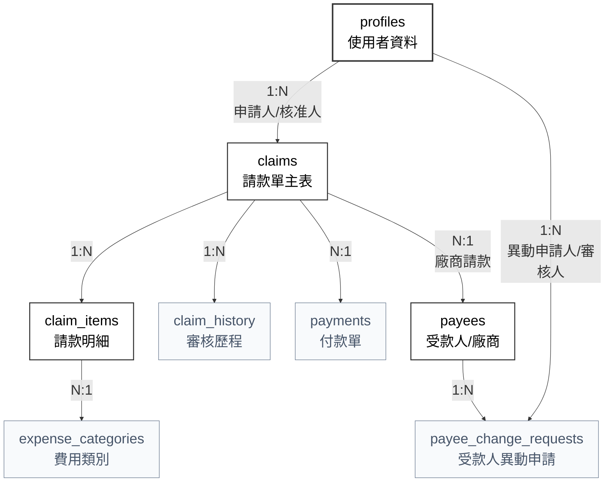

# 03_資料庫與資料規約

> 彙整文件：資料庫設計文件、資料操作規格表、銀行代碼對照表  
> 最後更新：2026-02-11  
> 資料庫：PostgreSQL (Supabase)

---

## 📖 目錄

- [1. 資料模型概覽](#1-資料模型概覽)
- [2. 資料表定義](#2-資料表定義)
    - [2.1 profiles (員工資訊表)](#21-profiles-員工資訊表)
    - [2.2 claims (請款單主檔)](#22-claims-請款單主檔)
    - [2.3 claim_items (請款明細)](#23-claim_items-請款明細)
    - [2.4 claim_history (審核歷程)](#24-claim_history-審核歷程)
    - [2.5 payees (受款人主檔)](#25-payees-受款人主檔)
    - [2.6 payee_change_requests (受款人異動申請)](#26-payee_change_requests-受款人異動申請)
    - [2.7 payments (付款單)](#27-payments-付款單)
    - [2.8 expense_categories (費用類別)](#28-expense_categories-費用類別)
- [3. Row Level Security (RLS) 策略](#3-row-level-security-rls-策略)
- [4. 自動化觸發器 (Triggers)](#4-自動化觸發器-triggers)
- [5. 加密欄位處理](#5-加密欄位處理)
- [6. 索引策略摘要](#6-索引策略摘要)
- [7. 資料操作規格 (API)](#7-資料操作規格-api)
    - [7.1 認證模組 (Auth)](#71-認證模組-auth)
    - [7.2 使用者模組 (Users)](#72-使用者模組-users)
    - [7.3 請款單模組 (Claims)](#73-請款單模組-claims)
    - [7.4 審核模組 (Approval)](#74-審核模組-approval)
    - [7.5 付款模組 (Payments)](#75-付款模組-payments)
    - [7.6 補件模組 (Document Supplement)](#76-補件模組-document-supplement)
    - [7.7 廠商模組 (Vendors)](#77-廠商模組-vendors)
    - [7.8 憑證模組 (Attachments)](#78-憑證模組-attachments)
    - [7.9 費用類別模組 (Categories)](#79-費用類別模組-categories)
    - [7.10 發票重複檢查](#710-發票重複檢查)
- [8. 通用資料結構 (TypeScript)](#8-通用資料結構-typescript)
- [9. 銀行代碼對照表](#9-銀行代碼對照表)

---

## 1. 資料模型概覽



**關聯說明**：
- 一個「付款單」可包含多個「請款單」 (批次付款)
- 一個「請款單」僅屬於一個「付款單」
- 直接透過 `claims.payment_id` 外鍵建立一對多關係 (無需關聯表)

---

## 2. 資料表定義

### 2.1 profiles (員工資訊表)

> 職責：擴充 Supabase Auth 的使用者資訊，儲存工號與角色。

| 欄位 | 型別 | 說明 | 備註 |
|-----|------|------|------|
| `id` | uuid | 主鍵 | FK → auth.users.id |
| `full_name` | text | 姓名 | |
| `is_finance` | boolean | 財務權限 | 預設 false |
| `is_admin` | boolean | 管理員權限 | 預設 false |
| `approver_id` | uuid | 核准人 | FK → profiles.id |
| `bank` | varchar(20) | 傳帳銀行 | 格式: 代碼-名稱 (如 004-台灣銀行) |
| `bank_account` | bytea | 傳帳帳號 | 加密儲存，首次登入填寫，後續僅管理員可修改 |
| `avatar_url` | text | 大頭貼 | |
| `created_at` | timestamptz | 建立時間 | |
| `updated_at` | timestamptz | 更新時間 | |

**索引**：
- `profiles_approver_id_idx` ON (approver_id)

---

### 2.2 claims (請款單主檔)

| 欄位 | 型別 | 說明 | 備註 |
|-----|------|------|------|
| `id` | varchar(8) | 主鍵 | 8 碼隨機英數字識別碼 |
| `claim_type` | enum | 類別 | employee/vendor/personal_service |
| `status` | enum | 狀態 | 見狀態列舉 |
| `applicant_id` | uuid | 申請人 | FK → profiles.id |
| `payee_id` | uuid | 外部受款人 | FK → payees.id (NULL 則為申請人本人) |
| `payment_id` | uuid | 付款單 | FK → payments.id (付款後回填) |
| `total_amount` | decimal(12,0) | 總金額 | 求和 claim_items |
| `submitted_at` | timestamptz | 送出時間 | |
| `created_at` | timestamptz | 建立時間 | |
| `updated_at` | timestamptz | 更新時間 | |

*(註：採方案 C 設計。員工個人報銷時 payee_id 為空；委外廠商或個人勞務則連結至受款人主檔)*

**請款單狀態列舉 (claim_status)**：
```sql
CREATE TYPE claim_status AS ENUM (
  'draft',              -- 草稿
  'pending_manager',    -- 主管審核
  'pending_finance',    -- 財務審核
  'pending_payment',    -- 待付款
  'paid',               -- 付款完成
  'paid_pending_doc',   -- 付款完成(待補件)
  'pending_doc_review', -- 補件審核
  'returned',           -- 已退回
  'cancelled'           -- 已撤銷
);
```

**索引**：
- `claims_applicant_id_idx` ON (applicant_id)
- `claims_payee_id_idx` ON (payee_id)
- `claims_status_idx` ON (status)
- `claims_created_at_idx` ON (created_at DESC)
- `claims_payment_id_idx` ON (payment_id)

---

### 2.3 claim_items (請款明細)

| 欄位 | 型別 | 說明 | 備註 |
|-----|------|------|------|
| `id` | uuid | 主鍵 | |
| `claim_id` | varchar(8) | 請款單 | FK → claims.id |
| `item_index` | int | 項目序號 | |
| `date_start` | date | 發票/開始日 | 員工/廠商報銷 = 發票日期 |
| `date_end` | date | 交易結束日 | 員工/廠商報銷 = NULL |
| `category` | varchar(10) | 費用類別 | |
| `description` | text | 說明 | |
| `amount` | decimal(12,0) | 金額 | |
| `invoice_number` | varchar(10) | 發票號碼 | |
| `attachment_id` | uuid | 憑證 ID | |
| `attachment_status` | enum | 憑證狀態 | uploaded/exempt/pending_supplement |
| `extra` | jsonb | 額外資訊 | no_evidence_reason: 免附原因 (status=exempt 時), file_path/original_name: 憑證檔案資訊 |

**索引**：
- `claim_items_claim_id_idx` ON (claim_id)
- `claim_items_invoice_number_idx` ON (invoice_number)

---

### 2.4 claim_history (審核歷程)

| 欄位 | 型別 | 說明 | 備註 |
|-----|------|------|------|
| `id` | uuid | 主鍵 | |
| `claim_id` | varchar(8) | 請款單 | FK → claims.id |
| `actor_id` | uuid | 執行者 | FK → profiles.id |
| `action` | varchar(10) | 動作 | submit/approve/reject/withdraw... |
| `from_status` | enum | 來源狀態 | |
| `to_status` | enum | 目標狀態 | |
| `comment` | text | 備註 | |
| `created_at` | timestamptz | 時間 | |

**索引**：
- `claim_history_claim_id_idx` ON (claim_id)
- `claim_history_created_at_idx` ON (created_at DESC)

---

### 2.5 payees (受款人主檔)

| 欄位 | 型別 | 說明 | 備註 |
|-----|------|------|------|
| `id` | uuid | 主鍵 | |
| `type` | enum | 受款人類型 | vendor/personal |
| `name` | varchar(20) | 名稱 | 公司名或個人姓名 |
| `tax_id` | bytea | 統編/身分證 | 加密儲存 |
| `bank` | varchar(20) | 銀行 | 格式: 代碼-名稱 (如 004-台灣銀行) |
| `bank_account` | bytea | 銀行帳號 | 加密儲存 |
| `service_description` | text | 服務內容 | |
| `extra_info` | jsonb | 類型專屬資料 | vendor: {is_floating_account}, personal: {email, address} |
| `status` | enum | 狀態 | pending_add/pending_update/pending_disable/available/disabled |
| `created_at` | timestamptz | 建立時間 | |
| `updated_at` | timestamptz | 更新時間 | |

**索引**：
- `payees_name_idx` ON (name)
- `payees_status_idx` ON (status)
- `payees_type_idx` ON (type)

---

### 2.6 payee_change_requests (受款人異動申請)

| 欄位 | 型別 | 說明 | 備註 |
|-----|------|------|------|
| `id` | uuid | 主鍵 | |
| `payee_id` | uuid | 受款人 | FK → payees.id (新增時為 null) |
| `change_type` | enum | 異動類型 | create/update/disable |
| `requested_by` | uuid | 申請人 | FK → profiles.id |
| `reviewed_by` | uuid | 審核人 | FK → profiles.id |
| `status` | enum | 狀態 | pending/approved/rejected |
| `reason` | text | 申請原因 | |
| `reject_reason` | text | 駁回原因 | |
| `proposed_data` | jsonb | 異動欄位 | 只含有異動的非敏感欄位 |
| `proposed_bank_account` | bytea | 新銀行帳號 | 加密儲存，有異動時才填 |
| `created_at` | timestamptz | 申請時間 | |
| `reviewed_at` | timestamptz | 審核時間 | |

---

### 2.7 payments (付款單)

| 欄位 | 型別 | 說明 | 備註 |
|-----|------|------|------|
| `id` | uuid | 主鍵 | UUID 作為唯一識別碼 |
| `payee_id` | uuid | 外部受款人 ID | FK → payees.id (NULL 則為員工本人) |
| `payee_name` | varchar(20) | 受款對象名稱 | 冗餘儲存以便快速檢視 |
| `total_amount` | decimal(12,0) | 付款總額 | |
| `bank` | varchar(20) | 傳帳銀行 | 付款當下快照 |
| `bank_account` | bytea | 傳帳帳號 | 加密儲存，付款當下快照 |
| `status` | enum | 狀態 | completed/cancelled |
| `paid_by` | uuid | 付款執行者 | FK → profiles.id |
| `paid_at` | timestamptz | 付款時間 | |
| `cancelled_at` | timestamptz | 取消時間 | |
| `created_at` | timestamptz | 建立時間 | |

---

### 2.8 expense_categories (費用類別)

| 欄位 | 型別 | 說明 | 備註 |
|-----|------|------|------|
| `id` | uuid | 主鍵 | |
| `name` | varchar(50) | 類別名稱 | 唯一 |
| `is_active` | boolean | 啟用中 | |
| `updated_at` | timestamptz | 更新時間 | |
| `created_at` | timestamptz | 建立時間 | |

---

## 3. Row Level Security (RLS) 策略

### 3.1 權限輔助函數 (Security Definer)

為了避免 RLS 遞迴並提高效能，使用 `SECURITY DEFINER` 函數來檢查角色權限：

```sql
-- 檢查是否為管理員
CREATE OR REPLACE FUNCTION public.is_admin()
RETURNS boolean AS $$
BEGIN
  RETURN EXISTS (
    SELECT 1 FROM public.profiles 
    WHERE id = auth.uid() AND is_admin = true
  );
END;
$$ LANGUAGE plpgsql SECURITY DEFINER;

-- 檢查是否為財務人員
CREATE OR REPLACE FUNCTION public.is_finance()
RETURNS boolean AS $$
BEGIN
  RETURN EXISTS (
    SELECT 1 FROM public.profiles 
    WHERE id = auth.uid() AND is_finance = true
  );
END;
$$ LANGUAGE plpgsql SECURITY DEFINER;
```

### 3.2 核心 RLS 政策

```sql
-- =============================================
-- profiles (員工資訊表)
-- =============================================
-- 本人可讀自己的資料
CREATE POLICY "profiles_individual_read" ON profiles 
    FOR SELECT USING (auth.uid() = id);

-- 本人可更新自己的資料 (首次填寫銀行帳號，後續修改需管理員)
CREATE POLICY "profiles_individual_update" ON profiles 
    FOR UPDATE USING (auth.uid() = id);

-- 管理員可管理所有 profile
CREATE POLICY "profiles_admin_all" ON profiles 
    FOR ALL USING (public.is_admin());

-- =============================================
-- claims (請款單)
-- =============================================
-- 申請人：可完全管理自己的請款單
CREATE POLICY "claims_applicant" ON claims 
    FOR ALL USING (auth.uid() = applicant_id);

-- 主管：可讀取下屬的請款單
CREATE POLICY "claims_approver_read" ON claims 
    FOR SELECT USING (
        EXISTS (
            SELECT 1 FROM profiles 
            WHERE profiles.id = claims.applicant_id 
            AND profiles.approver_id = auth.uid()
        )
    );

-- 主管：可更新下屬的請款單 (核准/退回)
CREATE POLICY "claims_approver_update" ON claims 
    FOR UPDATE USING (
        EXISTS (
            SELECT 1 FROM profiles 
            WHERE profiles.id = claims.applicant_id 
            AND profiles.approver_id = auth.uid()
        )
    );

-- 財務：可讀取所有請款單
CREATE POLICY "claims_finance_read" ON claims 
    FOR SELECT USING (public.is_finance());

-- 財務：可更新所有請款單狀態 (核准/駁回/付款)
CREATE POLICY "claims_finance_update" ON claims 
    FOR UPDATE USING (public.is_finance());

-- =============================================
-- claim_items (請款明細)
-- =============================================
-- 申請人：可管理自己請款單的明細
CREATE POLICY "items_applicant" ON claim_items 
    FOR ALL USING (
        EXISTS (SELECT 1 FROM claims WHERE claims.id = claim_items.claim_id AND claims.applicant_id = auth.uid())
    );

-- 主管：可讀取下屬請款單的明細
CREATE POLICY "items_approver_read" ON claim_items 
    FOR SELECT USING (
        EXISTS (
            SELECT 1 FROM claims 
            JOIN profiles ON profiles.id = claims.applicant_id
            WHERE claims.id = claim_items.claim_id 
            AND profiles.approver_id = auth.uid()
        )
    );

-- 財務：可讀取所有明細
CREATE POLICY "items_finance_read" ON claim_items 
    FOR SELECT USING (
        EXISTS (SELECT 1 FROM profiles p WHERE p.id = auth.uid() AND p.is_finance = true)
    );

-- =============================================
-- claim_history (審核歷程)
-- =============================================
-- 申請人：可讀取自己請款單的歷程
CREATE POLICY "history_applicant_read" ON claim_history 
    FOR SELECT USING (
        EXISTS (SELECT 1 FROM claims WHERE claims.id = claim_history.claim_id AND claims.applicant_id = auth.uid())
    );

-- 主管：可讀取下屬請款單的歷程
CREATE POLICY "history_approver_read" ON claim_history 
    FOR SELECT USING (
        EXISTS (
            SELECT 1 FROM claims 
            JOIN profiles ON profiles.id = claims.applicant_id
            WHERE claims.id = claim_history.claim_id 
            AND profiles.approver_id = auth.uid()
        )
    );

-- 財務：可讀取所有歷程
CREATE POLICY "history_finance_read" ON claim_history 
    FOR SELECT USING (
        EXISTS (SELECT 1 FROM profiles p WHERE p.id = auth.uid() AND p.is_finance = true)
    );

-- =============================================
-- payees (受款人主檔)
-- =============================================
-- 所有員工可讀取
CREATE POLICY "payees_read_all" ON payees 
    FOR SELECT USING (true);

-- (註：受款人異動均透過 payee_change_requests 流程，核准後由 Trigger/Function 自動更新 payees 表)

-- =============================================
-- payee_change_requests (受款人異動申請)
-- =============================================
-- 申請人可完全管理自己的申請 (新增/讀取/更新/刪除)
CREATE POLICY "payee_change_own" ON payee_change_requests 
    FOR ALL USING (requested_by = auth.uid());

-- 財務可讀取所有申請
CREATE POLICY "payee_change_read_finance" ON payee_change_requests 
    FOR SELECT USING (
        EXISTS (SELECT 1 FROM profiles p WHERE p.id = auth.uid() AND p.is_finance = true)
    );

-- 財務可更新申請 (核准/駁回)
CREATE POLICY "payee_change_update_finance" ON payee_change_requests 
    FOR UPDATE USING (
        EXISTS (SELECT 1 FROM profiles p WHERE p.id = auth.uid() AND p.is_finance = true)
    );

-- =============================================
-- payments (付款單)
-- =============================================
-- 申請人：可讀取自己相關的付款單
CREATE POLICY "payments_applicant_read" ON payments 
    FOR SELECT USING (
        id IN (SELECT payment_id FROM claims WHERE applicant_id = auth.uid())
    );

-- 主管：可讀取下屬相關的付款單
CREATE POLICY "payments_approver_read" ON payments 
    FOR SELECT USING (
        EXISTS (
            SELECT 1 FROM claims 
            JOIN profiles ON profiles.id = claims.applicant_id
            WHERE claims.payment_id = payments.id 
            AND profiles.approver_id = auth.uid()
        )
    );

-- 財務：可完全管理付款單
CREATE POLICY "payments_finance" ON payments 
    FOR ALL USING (
        EXISTS (SELECT 1 FROM profiles p WHERE p.id = auth.uid() AND p.is_finance = true)
    );

-- =============================================
-- expense_categories (費用類別)
-- =============================================
-- 所有員工可讀取
CREATE POLICY "categories_read_all" ON expense_categories 
    FOR SELECT USING (true);

-- 管理員可管理
CREATE POLICY "categories_admin" ON expense_categories 
    FOR ALL USING (
        EXISTS (SELECT 1 FROM profiles p WHERE p.id = auth.uid() AND p.is_admin = true)
    );
```

### 3.3 Storage 物件權限補充 (storage.objects)

> 下列為與憑證檔案直接相關的安全策略摘要，實際以 migration 為準：

- `claims` bucket：
  - `SELECT`：僅申請人本人、其主管鏈、財務、管理員可讀取
  - `INSERT/UPDATE/DELETE`：限定請款單擁有者與可編輯狀態
- `payees` bucket：
  - `SELECT/UPDATE/DELETE`：僅檔案 owner 或 `is_finance` / `is_admin`
  - `INSERT`：登入使用者可上傳（供受款人申請流程使用）

---

## 4. 自動化觸發器 (Triggers)

### 4.1 使用者自動同步 (Auth Sync)

當新使用者透過 Google OAuth 註冊時，會自動建立對應的 `profiles` 表紀錄。

```sql
CREATE OR REPLACE FUNCTION public.handle_new_user()
RETURNS TRIGGER AS $$
BEGIN
    INSERT INTO public.profiles (id, full_name, avatar_url, is_admin, is_finance)
    VALUES (
        new.id,
        COALESCE(new.raw_user_meta_data->>'full_name', split_part(new.email, '@', 1)),
        new.raw_user_meta_data->>'avatar_url',
        false, -- 正式環境預設為一般員工
        false  -- 正式環境預設非財務人員
    );
    RETURN new;
END;
$$ LANGUAGE plpgsql SECURITY DEFINER;

-- 確保先移除舊的觸發器再建立，避免 "already exists" 錯誤
DROP TRIGGER IF EXISTS on_auth_user_created ON auth.users;
CREATE TRIGGER on_auth_user_created
AFTER INSERT ON auth.users
FOR EACH ROW EXECUTE FUNCTION public.handle_new_user();
```

### 4.2 審核歷程自動記錄 (Claim History)

當請款單狀態變更時，系統會自動在 `claim_history` 表插入一筆審核紀錄，不需應用端手動寫入。

```sql
CREATE OR REPLACE FUNCTION log_claim_status_change()
RETURNS TRIGGER AS $$
BEGIN
    IF OLD.status IS DISTINCT FROM NEW.status THEN
        INSERT INTO claim_history (
            claim_id, actor_id, action, from_status, to_status, created_at
        ) VALUES (
            NEW.id, auth.uid(), 'status_change', OLD.status, NEW.status, now()
        );
    END IF;
    RETURN NEW;
END;
$$ LANGUAGE plpgsql SECURITY DEFINER;

CREATE TRIGGER trigger_claim_status_change
AFTER UPDATE ON claims
FOR EACH ROW EXECUTE FUNCTION log_claim_status_change();
```

---

## 5. 加密欄位處理

敏感欄位使用 PostgreSQL `pgcrypto` 加密：

> 實務補充：
> 1. extension 安裝於 `extensions` schema：`CREATE EXTENSION IF NOT EXISTS pgcrypto WITH SCHEMA extensions;`
> 2. 為避免 `SECURITY DEFINER + search_path=public` 函數找不到 pgcrypto，系統提供 `public.pgp_sym_encrypt/decrypt` wrapper 轉呼叫 `extensions.pgp_sym_*`。

```sql
-- 加密
UPDATE profiles SET bank_account = pgp_sym_encrypt(
  '123456789', 
  current_setting('app.encryption_key')
);

-- 解密
SELECT pgp_sym_decrypt(
  bank_account::bytea, 
  current_setting('app.encryption_key')
) FROM profiles;
```

**加密欄位清單**：
- `profiles.bank_account`
- `payees.tax_id`, `payees.bank_account`
- `payments.bank_account`
- `payee_change_requests.proposed_bank_account`

---

## 6. 索引策略摘要

| 表格 | 索引 | 用途 |
|-----|------|------|
| claims | applicant_id | 查詢「我的請款」 |
| claims | payee_id | 查詢對象歷史 |
| claims | status | 依狀態篩選 |
| claims | created_at DESC | 時間排序 |
| claims | payment_id | 付款單關聯查詢 |
| claim_items | claim_id | 關聯查詢 |
| claim_items | invoice_number | 重複發票檢查 |
| claim_history | claim_id + created_at | 審核軌跡查詢 |
| payees | name | 對象搜尋 |
| payees | status | 狀態篩選 |
| payees | type | 類型篩選 |

---

## 7. 資料操作規格 (API)

> 說明：定義系統中所有資料操作的輸入/輸出規格，供開發時參考

### 7.1 認證模組 (Auth)

| 操作 | 說明 | 輸入 | 輸出 |
|------|------|------|------|
| `signInWithGoogle()` | Google OAuth 登入 | - | `Session` |
| `signOut()` | 登出 | - | - |
| `getSession()` | 取得目前 Session | - | `Session \| null` |
| `getCurrentUser()` | 取得目前使用者資料 | - | `User` |

---

### 7.2 使用者模組 (Users)

#### 讀取操作

| 操作 | 說明 | 輸入 | 輸出 | 權限 |
|------|------|------|------|------|
| `getUsers()` | 取得使用者清單 | `{ search?, role? }` | `User[]` | Admin |
| `getUserById()` | 取得單一使用者 | `userId` | `User` | Self/Admin |
| `getApproverOptions()` | 取得可選擇的核准人 | - | `User[]` | Admin |

#### 寫入操作

| 操作 | 說明 | 輸入 | 輸出 | 權限 |
|------|------|------|------|------|
| `updateProfile()` | 更新個人資料 | `{ name, bank_code, bank_account, ... }` | `User` | Self |
| `assignApprover()` | 指派核准人 | `{ userId, approverId }` | `User` | Admin |
| `updateUserRole()` | 更新使用者角色 | `{ userId, role }` | `User` | Admin |

---

### 7.3 請款單模組 (Claims)

#### 讀取操作

| 操作 | 說明 | 輸入 | 輸出 | 權限 |
|------|------|------|------|------|
| `getMyClaims()` | 取得我的請款單 | `{ status?, type?, dateFrom?, dateTo? }` | `Claim[]` | All |
| `getDraftClaims()` | 取得草稿 | - | `Claim[]` | Self |
| `getPendingClaims()` | 取得處理中單據 | - | `Claim[]` | Self |
| `getReturnedClaims()` | 取得已退回單據 | - | `Claim[]` | Self |
| `getClaimById()` | 取得單一請款單 | `claimId` | `ClaimDetail` | Owner/Approver/Finance |
| `getClaimHistory()` | 取得審核歷程 | `claimId` | `ClaimHistory[]` | Owner/Approver/Finance |

#### 寫入操作

| 操作 | 說明 | 輸入 | 輸出 | 權限 |
|------|------|------|------|------|
| `createClaim()` | 新增請款單 | `ClaimInput` | `Claim` | All |
| `updateClaim()` | 更新請款單 (草稿) | `{ claimId, ...ClaimInput }` | `Claim` | Owner (draft only) |
| `deleteClaim()` | 刪除請款單 | `claimId` | - | Owner (draft only) |
| `submitClaim()` | 提交請款單 | `claimId` | `Claim` | Owner |
| `withdrawClaim()` | 撤回請款單 | `claimId` | `Claim` | Owner |
| `resubmitClaim()` | 重新提交 | `claimId` | `Claim` | Owner (returned) |
| `cancelClaim()` | 撤銷請款單 | `claimId` | `Claim` | Owner (returned) |

#### 請款單輸入結構

```typescript
// 請款單輸入
interface ClaimInput {
  claim_type: 'employee' | 'vendor' | 'personal_service';
  description: string;
  vendor_id?: string;              // 廠商請款用
  personal_service_data?: {        // 個人勞務用
    name: string;
    id_number: string;
    email: string;
    address: string;
    bank_code: string;
    bank_account: string;
    service_period_start: string;
    service_period_end: string;
  };
  items: ClaimItemInput[];
}

// 請款明細輸入
interface ClaimItemInput {
  date: string;
  category: string;
  description: string;
  amount: number;
  invoice_number?: string;
  invoice_date?: string;
  no_evidence_flag?: boolean;
  no_evidence_reason?: string;
  attachment?: File;
}
```

---

### 7.4 審核模組 (Approval)

#### 讀取操作

| 操作 | 說明 | 輸入 | 輸出 | 權限 |
|------|------|------|------|------|
| `getPendingApproval()` | 取得待審核清單 (主管) | - | `Claim[]` | Manager |
| `getFinanceReview()` | 取得待財務審核 | - | `Claim[]` | Finance |
| `getPendingPayment()` | 取得待付款清單 | - | `Claim[]` | Finance |
| `getDocReview()` | 取得補件審核清單 | - | `Claim[]` | Finance |
| `getAllClaims()` | 取得所有單據 | `{ search?, status?, type?, ... }` | `Claim[]` | Finance/Admin |

#### 寫入操作

| 操作 | 說明 | 輸入 | 輸出 | 權限 |
|------|------|------|------|------|
| `approveClaim()` | 核准請款單 | `{ claimId, comment? }` | `Claim` | Manager/Finance |
| `rejectClaim()` | 駁回請款單 | `{ claimId, comment }` | `Claim` | Manager/Finance |
| `approveDoc()` | 核准補件 | `{ claimId, comment? }` | `Claim` | Finance |
| `rejectDoc()` | 駁回補件 | `{ claimId, comment }` | `Claim` | Finance |

#### 狀態轉換圖

> [!NOTE]
> 為確保業務邏輯的一致性，詳細的狀態機視覺化流程圖已統一維護於 [01_產品藍圖與開發計畫.md - 1.3.2 流程與狀態機可視化](file:///Users/candoyeh/Downloads/報銷系統/報銷_new/參考文件/01_產品藍圖與開發計畫.md#132-流程與狀態機可視化-state-diagram)。

#### 狀態轉換動作對照表

| 動作 | 來源狀態 | 目標狀態 | 執行者 |
|------|----------|----------|--------|
| submit | draft | pending_manager | 申請人 |
| withdraw | pending_manager | draft | 申請人 |
| withdraw | pending_finance | draft | 申請人 |
| approve | pending_manager | pending_finance | 主管 |
| reject | pending_manager | returned | 主管 |
| approve | pending_finance | pending_payment | 財務 |
| reject | pending_finance | returned | 財務 |
| resubmit | returned | pending_manager | 申請人 |
| cancel | returned | cancelled | 申請人 |
| pay | pending_payment | paid | 財務 |
| pay (需補件) | pending_payment | paid_pending_doc | 財務 |
| submit_doc | paid_pending_doc | pending_doc_review | 申請人 |
| approve | pending_doc_review | paid | 財務 |
| reject | pending_doc_review | paid_pending_doc | 財務 |
| revoke_approval | pending_payment | pending_finance | 財務 |
| cancel_payment | paid | pending_payment | 財務 |
| cancel_payment | paid_pending_doc | pending_payment | 財務 |

> ⚠️ **取消付款注意**：取消付款是針對「付款單」執行，會將該付款單內所有請款單退回 `pending_payment`

---

### 7.5 付款模組 (Payments)

#### 讀取操作

| 操作 | 說明 | 輸入 | 輸出 | 權限 |
|------|------|------|------|------|
| `getPayments()` | 取得付款單清單 | `{ status?, dateFrom?, dateTo? }` | `Payment[]` | Finance |
| `getPaymentById()` | 取得付款單詳情 | `paymentId` | `PaymentDetail` | Finance |

#### 寫入操作

| 操作 | 說明 | 輸入 | 輸出 | 權限 |
|------|------|------|------|------|
| `createPayment()` | 執行付款 (單筆) | `{ claimId, needDoc? }` | `Payment` | Finance |
| `createBatchPayment()` | 執行批次付款 | `{ claimIds[], needDoc? }` | `Payment` | Finance |
| `cancelPayment()` | 取消付款 | `paymentId` | `Payment` | Finance |
| `revokeApproval()` | 取消核准 | `claimId` | `Claim` | Finance |

#### 批次付款規則

```typescript
// 批次付款驗證
function validateBatchPayment(claims: Claim[]): boolean {
  // 1. 所有單據必須是 pending_payment 狀態
  // 2. 所有單據必須是同一付款對象 (同一 vendor_id 或同一 applicant_id)
  // 3. 無筆數上限、無金額上限
}
```

---

### 7.6 補件模組 (Document Supplement)

#### 寫入操作

| 操作 | 說明 | 輸入 | 輸出 | 權限 |
|------|------|------|------|------|
| `submitDocument()` | 提交補件 | `{ claimId, items: DocInput[] }` | `Claim` | Owner |

#### 補件輸入結構

```typescript
interface DocInput {
  item_id: string;
  type: 'upload' | 'no_evidence';
  attachment?: File;              // type = 'upload' 時
  no_evidence_reason?: string;    // type = 'no_evidence' 時
}
```

---

### 7.7 廠商模組 (Vendors)

#### 讀取操作

| 操作 | 說明 | 輸入 | 輸出 | 權限 |
|------|------|------|------|------|
| `getVendors()` | 取得廠商清單 | `{ search?, status? }` | `Vendor[]` | All |
| `getVendorById()` | 取得廠商詳情 | `vendorId` | `Vendor` | All |
| `getVendorChangeRequests()` | 取得異動申請 | `{ status? }` | `VendorChangeRequest[]` | Finance |

#### 寫入操作

| 操作 | 說明 | 輸入 | 輸出 | 權限 |
|------|------|------|------|------|
| `requestCreateVendor()` | 申請新增廠商 | `VendorInput` | `VendorChangeRequest` | All |
| `requestUpdateVendor()` | 申請修改廠商 | `{ vendorId, ...VendorInput }` | `VendorChangeRequest` | All |
| `requestDisableVendor()` | 申請停用廠商 | `{ vendorId, reason }` | `VendorChangeRequest` | All |
| `approveVendorChange()` | 核准廠商異動 | `{ requestId, comment? }` | `VendorChangeRequest` | Finance |
| `rejectVendorChange()` | 駁回廠商異動 | `{ requestId, comment }` | `VendorChangeRequest` | Finance |

---

### 7.8 憑證模組 (Attachments)

#### 操作

| 操作 | 說明 | 輸入 | 輸出 | 權限 |
|------|------|------|------|------|
| `uploadAttachment()` | 上傳憑證 | `{ claimId, itemIndex, file }` | `{ attachment_id, url }` | Owner |
| `deleteAttachment()` | 刪除憑證 | `attachment_id` | - | Owner (draft) |
| `getAttachmentUrl()` | 取得憑證 URL | `attachment_id` | `signedUrl` | Authorized |

#### 檔案限制

```typescript
const ATTACHMENT_RULES = {
  allowedTypes: ['application/pdf', 'image/jpeg', 'image/png'],
  maxSize: 10 * 1024 * 1024,  // 10MB
  path: '/claims/{claim_id}/attachments/{attachment_id}.{ext}'
};
```

---

### 7.9 費用類別模組 (Categories)

| 操作 | 說明 | 輸入 | 輸出 | 權限 |
|------|------|------|------|------|
| `getCategories()` | 取得費用類別 | - | `Category[]` | All |
| `createCategory()` | 新增類別 | `{ name }` | `Category` | Admin |
| `updateCategory()` | 更新類別 | `{ id, name, is_active }` | `Category` | Admin |

---

### 7.10 發票重複檢查

#### 操作

| 操作 | 說明 | 輸入 | 輸出 |
|------|------|------|------|
| `checkDuplicateInvoice()` | 檢查發票是否重複 | `{ invoice_number, vendor_id? }` | `DuplicateInfo \| null` |

#### 回傳結構

```typescript
interface DuplicateInfo {
  claim_id: string;
  claim_number: string;
  payee_name: string;
  amount: number;
  description: string;
}
```

---

## 8. 通用資料結構 (TypeScript)

### User
```typescript
interface User {
  id: string;
  email: string;
  name: string;
  role: 'applicant' | 'manager' | 'finance' | 'admin';
  approver_id: string | null;
  approver_name: string | null;
  bank_code: string | null;
  bank_name: string | null;
  bank_branch: string | null;
  bank_account: string | null;
  created_at: string;
  updated_at: string;
}
```

### Claim
```typescript
interface Claim {
  id: string;
  claim_number: string;
  claim_type: 'employee' | 'vendor' | 'personal_service';
  status: ClaimStatus;
  applicant_id: string;
  applicant_name: string;
  vendor_id: string | null;
  vendor_name: string | null;
  total_amount: number;
  description: string;
  has_evidence: boolean;
  created_at: string;
  updated_at: string;
  submitted_at: string | null;
  completed_at: string | null;
}

type ClaimStatus = 
  | 'draft'
  | 'pending_manager'
  | 'pending_finance'
  | 'pending_payment'
  | 'paid'
  | 'paid_pending_doc'
  | 'pending_doc_review'
  | 'returned'
  | 'cancelled';
```

### Vendor
```typescript
interface Vendor {
  id: string;
  name: string;
  service_description: string | null;
  bank_code: string;
  bank_name: string | null;
  bank_account: string;
  is_floating_account: boolean;
  status: 'pending' | 'approved' | 'disabled';
  created_at: string;
  updated_at: string;
}
```

### Payment
```typescript
interface Payment {
  id: string;
  payment_number: string;
  payee_type: 'employee' | 'vendor' | 'personal';
  payee_id: string;
  payee_name: string;
  total_amount: number;
  bank_code: string;
  bank_account: string;
  status: 'completed' | 'cancelled';
  paid_by: string;
  paid_at: string;
  cancelled_at: string | null;
  claims: Claim[];  // 包含的請款單
}
```

---

## 9. 銀行代碼對照表

> 用途：前端下拉選單  
> 格式：代碼 + 四字簡稱

### 公股銀行

| 代碼 | 簡稱 |
|-----|------|
| 004 | 臺灣銀行 |
| 005 | 土地銀行 |
| 006 | 合作金庫 |
| 007 | 第一銀行 |
| 008 | 華南銀行 |
| 009 | 彰化銀行 |
| 011 | 上海商銀 |
| 012 | 台北富邦 |
| 013 | 國泰世華 |
| 016 | 高雄銀行 |
| 017 | 兆豐商銀 |

### 民營銀行

| 代碼 | 簡稱 |
|-----|------|
| 050 | 臺灣企銀 |
| 052 | 渣打商銀 |
| 053 | 台中銀行 |
| 054 | 京城銀行 |
| 081 | 匯豐銀行 |
| 102 | 華泰銀行 |
| 103 | 新光銀行 |
| 108 | 陽信銀行 |
| 118 | 板信銀行 |
| 147 | 三信銀行 |

### 商業銀行

| 代碼 | 簡稱 |
|-----|------|
| 803 | 聯邦銀行 |
| 805 | 遠東銀行 |
| 806 | 元大銀行 |
| 807 | 永豐銀行 |
| 808 | 玉山銀行 |
| 809 | 凱基銀行 |
| 810 | 星展銀行 |
| 812 | 台新銀行 |
| 814 | 大眾銀行 |
| 815 | 日盛銀行 |
| 816 | 安泰銀行 |
| 822 | 中國信託 |
| 823 | 將來銀行 |
| 824 | 連線銀行 |
| 826 | 樂天銀行 |

### 郵局與農漁會

| 代碼 | 簡稱 |
|-----|------|
| 700 | 中華郵政 |
| 951 | 農金資訊 |

---

### 前端使用範例 (TypeScript)

```typescript
export const BANK_LIST = [
  { code: '004', name: '臺灣銀行' },
  { code: '005', name: '土地銀行' },
  { code: '006', name: '合作金庫' },
  { code: '007', name: '第一銀行' },
  { code: '008', name: '華南銀行' },
  { code: '009', name: '彰化銀行' },
  { code: '011', name: '上海商銀' },
  { code: '012', name: '台北富邦' },
  { code: '013', name: '國泰世華' },
  { code: '016', name: '高雄銀行' },
  { code: '017', name: '兆豐商銀' },
  { code: '050', name: '臺灣企銀' },
  { code: '052', name: '渣打商銀' },
  { code: '053', name: '台中銀行' },
  { code: '054', name: '京城銀行' },
  { code: '081', name: '匯豐銀行' },
  { code: '102', name: '華泰銀行' },
  { code: '103', name: '新光銀行' },
  { code: '108', name: '陽信銀行' },
  { code: '118', name: '板信銀行' },
  { code: '147', name: '三信銀行' },
  { code: '700', name: '中華郵政' },
  { code: '803', name: '聯邦銀行' },
  { code: '805', name: '遠東銀行' },
  { code: '806', name: '元大銀行' },
  { code: '807', name: '永豐銀行' },
  { code: '808', name: '玉山銀行' },
  { code: '809', name: '凱基銀行' },
  { code: '810', name: '星展銀行' },
  { code: '812', name: '台新銀行' },
  { code: '815', name: '日盛銀行' },
  { code: '816', name: '安泰銀行' },
  { code: '822', name: '中國信託' },
  { code: '823', name: '將來銀行' },
  { code: '824', name: '連線銀行' },
  { code: '826', name: '樂天銀行' },
] as const;

// 取得銀行名稱
export const getBankName = (code: string) => 
  BANK_LIST.find(b => b.code === code)?.name ?? code;
```

---

## 附錄 A：實作對照 (2026-02-12)

> 本附錄用於將「文件規格名稱」與「目前實際路由 Action / RPC」對齊。若與上方抽象 API 命名不同，以此附錄與實際程式碼為準。

### A.1 Route Actions 對照

| 模組 | 路由 | Action | 說明 |
|------|------|--------|------|
| Claims | `/claims/new` | `create` | 建立草稿（employee/vendor/personal_service） |
| Claims | `/claims/[id]` | `update` / `submit` / `withdraw` / `approve` / `reject` / `cancel` / `delete` / `togglePayFirst` | 請款生命週期主要動作 |
| Claims | `/claims/[id]` | `upload` / `delete_attachment` | 明細附件上傳與刪除 |
| Approval | `/approval` | `batchPay` | 批次付款（僅 finance/admin） |
| Payments | `/payments/[id]` | `cancelPayment` | 付款沖帳（僅 finance/admin） |
| Payees | `/payees/new` | `createPayeeRequest` | 提交新增受款人申請 |
| Payees | `/payees/[id]/edit` | `updatePayeeRequest` | 提交更新受款人申請 |
| Payees | `/payees` | `submitDisableRequest` / `approvePayeeRequest` / `rejectPayeeRequest` / `withdrawRequest` | 受款人異動流程 |
| Admin | `/admin/users` | `updateUserPermissions` / `assignApprover` | 管理員角色與核准人維護 |
| Account | `/account` | `updateProfile` / `revealAccount` | 個資更新與加密帳號揭露 |

### A.2 最新 migration 同步

已新增並套用：

- `20260211140049_allow_approver_read_subordinate_profiles.sql`
- `20260211151000_allow_finance_read_profiles.sql`

目的：

- 補齊主管在審核流程對下屬 profile 的讀取權限。
- 補齊財務角色對 profile 的讀取權限，避免審核/付款流程受限。

### A.3 狀態機與權限實作備註

- `approve/reject` 在 `/claims/[id]` 會依當前狀態與角色決定下一步：
  - `pending_manager`：主管可核准/駁回
  - `pending_finance`：財務可核准/駁回
  - `pending_doc_review`：財務可核准/駁回
- `batchPay` / `cancelPayment` 已在 server action 層加上角色保護（finance/admin）。
- 取消付款為「付款單層級」操作，會回滾同付款單下請款狀態（符合主規格）。

### A.4 測試覆蓋現況（資料層關聯）

- 端對端測試已涵蓋 claims/approval/payments/payees/RLS 主流程。
- 最新執行結果：`npm run test:e2e` → `40 passed`。

---

> 💡 **使用方式**：開發新功能時，依照本文件的欄位定義與 API 規格進行實作，確保資料一致性。
