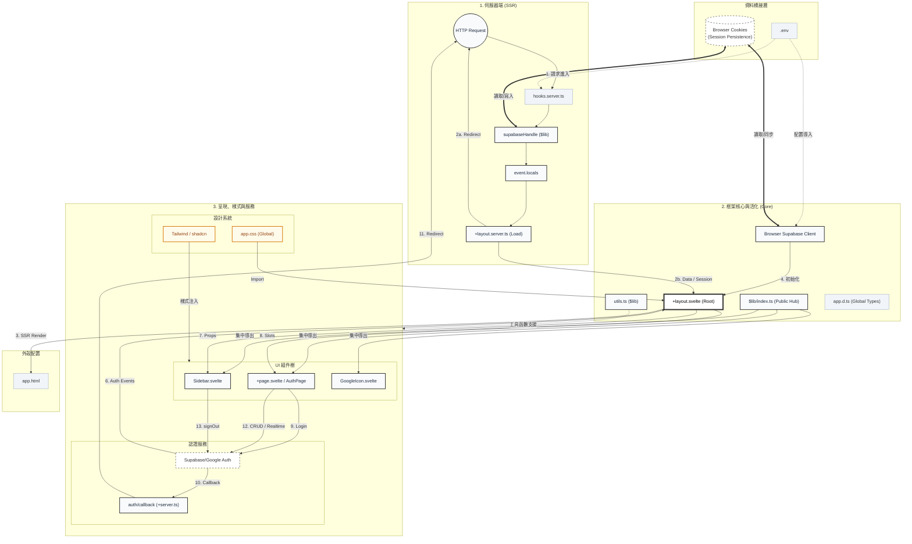

# 04_前端組件關聯與資料流

> 彙整文件：元件互動架構、認證資料流、全域狀態管理  
> 最後更新：2026-02-09

---

## 1. 以 +layout.svelte 為核心的完整架構

本系統採用 SvelteKit 的 **Root Layout** 作為認證同步與 UI 框架的核心。下圖展示了從伺服器端攔截、資料橋接（Cookies）到前端元件與工具函數的完整資料流向。

---

## 2. 關鍵架構星圖與職責

除了主要的組件與頁面，系統中還有幾個「隱藏」但至關重要的組成部分：

| 組件名稱 | 檔案路徑 | 代表職責 | 圖中角色 |
| :--- | :--- | :--- | :--- |
| **Cookies** | Browser Storage | **認證橋接器**：存放 Session，確保伺服器端與客戶端能共享同一份認證狀態。 | `Storage` |
| **$lib/index.ts** | `src/lib/index.ts` | **公共樞紐 (Public Hub)**：集中管理與導出所有常用組件與工具，縮短所有 `import` 路徑。 | `Center` |
| **app.d.ts** | `src/app.d.ts` | **全域型別定義**：定義 `Locals` 與 `PageData` 的強型別結構，確保開發時的即時提示。 | `Center` |
| **GoogleIcon** | `$lib/shared/GoogleIcon` | **高品質 UI 資產**：取代原有 Lucide 圖標，提供更專業的 Google 登入視覺體驗。 | `UI` |
| **supabase.ts** | `src/lib/supabase.ts` | **邏輯源頭**：包含 `supabaseHandle` (SSR) 與 `createClient` (CSR) 的底層配置。 | `LeftSide/Center` |

---

## 3. 核心資料流詳細說明 (13 個關鍵步驟)

### 3.1 階段一：伺服器攔截與認證橋接 (SSR & Bridge)
1.  **步驟 1：請求攔截 (Req -> Hooks)**：
    所有 HTTP 請求進入時，`hooks.server.ts` 第一時間攔截。
2.  **步驟 2：認證處理 (Hooks -> SB_Handle -> Locals)**：
    Hooks 呼叫 `supabaseHandle`，從瀏覽器 **Cookies** 提取憑證並與 Supabase 同步，隨後將實體注入 `event.locals`。
    *   *關鍵橋接*：此處達成伺服器端對使用者身份的初步識別。

### 3.2 階段二：決策、保護與初步渲染 (Gatekeeping & SSR Render)
3.  **步驟 2a：路由強制導向 (L_Server -> Req)**：
    `+layout.server.ts` 根據 `locals` 狀態判斷：若未登入且非 Auth 頁面，發起 `redirect(303, '/auth')`。
4.  **步驟 2b：資料配發 (L_Server -> Layout)**：
    通過安全檢查後，將 Session 與 User 資料封裝進 `data` 傳給 Root Layout。
5.  **步驟 3：渲染至外殼 (Layout -> HTML)**：
    `+layout.svelte` 將組件樹渲染成靜態 HTML，並填入 `app.html` 的外殼送往瀏覽器。

### 3.3 階段三：客戶端活化與監聽 (Hydration & Lifecycle)
6.  **步驟 4：客戶端初始化 (SB_Client -> Layout)**：
    瀏覽器端啟動，`SB_Client` 再次讀取 **Cookies** 初始化認證狀態，並與 Layout 綁定。
7.  **步驟 5：啟動生命週期監聽 (onMount)**：
    在 `onMount` 中啟動 `onAuthStateChange`，確保未來任何認證變動（如過期、主動登出）都能即時反應。
8.  **步驟 6：外部事件同步 (Provider -> Layout)**：
    Supabase 認證服務發送事件，Layout 接收後決定是否執行 `invalidate()` 更新全域資料。

### 3.4 階段四：組件配發與樣式注入 (Orchestration & Styling)
9.  **步驟 7 & 8：資料與內容分配 (Props / Slots)**：
    Layout 透過 **$lib/index.ts (Hub)** 引用的規範，將使用者資料傳給 `Sidebar` (Props)，並將頁面內容填入 `Children` (Slots)。
10. **樣式與工具注入 (CSS / Utils)**：
    `app.css` (全域) 與 `Tailwind/shadcn` (組件級) 同步進行樣式注入；`utils.ts` 則透過 **Hub** 為 UI 組件提供邏輯支援。

### 3.5 階段五：活化後互動循環 (Post-Hydration Interactions)
11. **認證循環 (步驟 9-11)**：
    使用者觸發 `Login` -> 跳轉 `Provider` -> 授權回傳 `Callback` -> 最終 `Redirect` 回到步驟 1 完成 Session 刷新。
12. **數據管理 (步驟 12-13)**：
    *   **12 (CRUD)**：頁面組件直接透過 `SB_Client` 與資料庫通訊。
    *   **13 (SignOut)**：側邊欄調用 `signOut` 清除 **Cookies** 與狀態，觸發全域重載。

> [!TIP]
> **架構總結**：
> 本系統透過 **Cookies** 解決了伺服器與客戶端的隔閡，並利用 **$lib 樞紐** 簡化了開發複雜度。這是一個「安全性優先、開發體驗友善」的現代 SvelteKit 架構。
