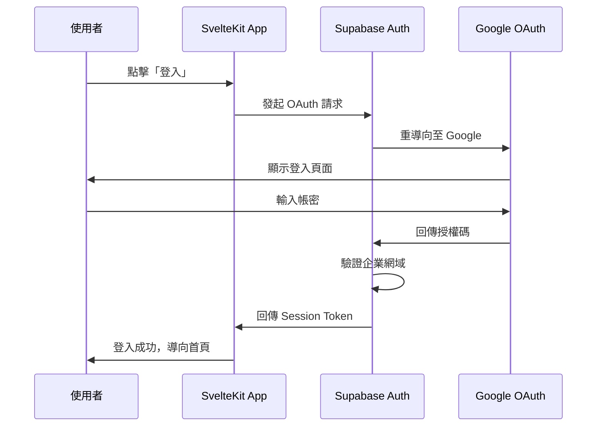
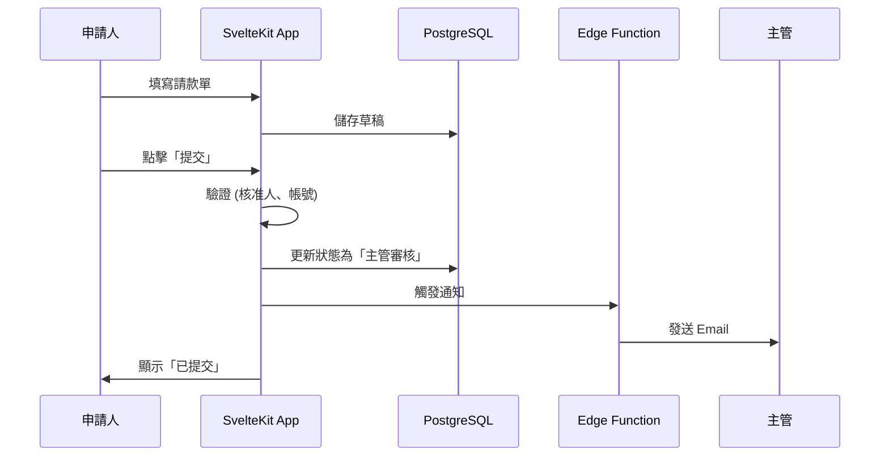
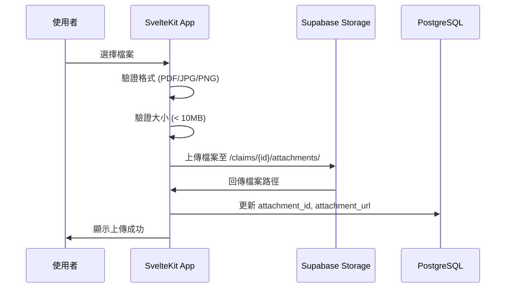

# 請款系統 技術架構文件

> 版本：1.0  
> 最後更新：2026-02-07  
> 相關文件：[產品規格書](./產品規格書_請款系統.md)、[資料庫設計文件](./資料庫設計文件.md)

---

## 1. 架構概覽

```
┌─────────────────────────────────────────────────────────────┐
│                         使用者                               │
│                    (瀏覽器 / 行動裝置)                        │
└─────────────────────────────────────────────────────────────┘
                              │
                              ▼
┌─────────────────────────────────────────────────────────────┐
│                    Vercel Edge Network                       │
│              ┌─────────────────────────────┐                │
│              │       SvelteKit App         │                │
│              │  ┌───────────┬───────────┐  │                │
│              │  │  Pages    │ API Routes│  │                │
│              │  │  (SSR)    │ (Server)  │  │                │
│              │  └───────────┴───────────┘  │                │
│              └─────────────────────────────┘                │
└─────────────────────────────────────────────────────────────┘
                              │
                              ▼
┌─────────────────────────────────────────────────────────────┐
│                        Supabase                              │
│  ┌──────────┐  ┌──────────┐  ┌──────────┐  ┌──────────┐    │
│  │PostgreSQL│  │   Auth   │  │ Storage  │  │ Realtime │    │
│  │ Database │  │(Google   │  │(憑證檔案) │  │(即時推送)│    │
│  │          │  │ OAuth)   │  │          │  │          │    │
│  └──────────┘  └──────────┘  └──────────┘  └──────────┘    │
│                                                              │
│              ┌─────────────────────────────┐                │
│              │      Edge Functions         │                │
│              │  (Email 通知、背景任務)      │                │
│              └─────────────────────────────┘                │
└─────────────────────────────────────────────────────────────┘
                              │
                              ▼
┌─────────────────────────────────────────────────────────────┐
│                  Google Workspace                            │
│              ┌─────────────────────────────┐                │
│              │      SMTP (Email 發送)       │                │
│              └─────────────────────────────┘                │
└─────────────────────────────────────────────────────────────┘
```

---

## 2. 技術棧詳細說明

### 2.1 前端 / 全端框架：SvelteKit

| 項目 | 說明 |
|-----|------|
| **框架版本** | SvelteKit 2.x |
| **語言** | TypeScript |
| **樣式** | Tailwind CSS |
| **UI 元件庫** | shadcn-svelte |
| **特性** | 編譯型框架，無 Virtual DOM，極致效能 |

**UI 元件庫 (shadcn-svelte)**：
- 基於 Tailwind CSS 的可複製元件庫
- 包含 Button, Input, Select, Table, Dialog, Toast 等 40+ 元件
- 元件複製到專案內，可完全客製化
- 安裝方式：`npx shadcn-svelte@latest init`

**關鍵技術實踐**：
- **Link Prefetching**：滑鼠移至連結時預載資料，實現「零延遲」導航
- **Optimistic UI**：儲存操作先更新畫面，不等 API 回應
- **Server Actions**：商務邏輯於伺服器端執行，安全且效能佳
- **Form Actions**：原生表單提交，無需額外前端狀態管理

### 2.2 基礎設施：Supabase

| 服務 | 用途 | 備註 |
|-----|------|------|
| **PostgreSQL** | 主要資料庫 | 支援 JSONB、原子事務 |
| **Auth** | 使用者認證 | Google OAuth 2.0 + 企業網域限制 |
| **Storage** | 憑證檔案存放 | Signed URL 存取控制 |
| **Realtime** | 即時資料推送 | 狀態變更即時通知 |
| **Edge Functions** | 背景任務 | Email 發送、檔案清理 |

### 2.3 部署平台：Vercel

| 項目 | 說明 |
|-----|------|
| **部署方式** | GitHub 主分支 Push 自動部署 |
| **Edge Network** | 全球 CDN 加速 |
| **Cron Jobs** | 定時任務執行 (每週清理孤立檔案) |
| **環境變數** | Supabase URL、API Key、SMTP 設定 |

### 2.4 Email 通知：Google Workspace SMTP

| 項目 | 說明 |
|-----|------|
| **發送帳號** | noreply@company.com |
| **每日限額** | 2,000 封 (Workspace 帳號) |
| **觸發方式** | Supabase Edge Functions 呼叫 |

---

## 3. 資料流程

### 3.1 使用者認證流程



### 3.2 請款單提交流程



### 3.3 憑證上傳流程



---

## 4. 效能最佳化策略

| 策略 | 實作方式 | 預期效果 |
|-----|---------|---------|
| **頁面預載** | SvelteKit Link Prefetching | 導航 < 100ms |
| **樂觀更新** | Optimistic UI Pattern | 儲存感覺即時 |
| **連線池** | Supabase 管理 | 無冷啟動延遲 |
| **圖片優化** | 憑證壓縮 + WebP | 載入更快 |
| **快取策略** | Vercel Edge Cache | 靜態資源極速 |

---

## 5. 安全性設計

### 5.1 認證與授權

| 層級 | 機制 |
|-----|------|
| **認證** | Supabase Auth + Google OAuth 2.0 |
| **企業限制** | 僅允許 @company.com 網域 |
| **Session** | Supabase 管理，過期自動登出 |
| **RBAC** | 角色權限控制 (申請人/主管/財務/管理員) |

### 5.2 資料安全

| 項目 | 機制 |
|-----|------|
| **傳輸加密** | HTTPS (Vercel 自動) |
| **靜態加密** | PostgreSQL 欄位加密 (銀行帳號、身分證) |
| **檔案存取** | Supabase Signed URL (有時效) |
| **RLS** | Row Level Security (僅存取自己的資料) |

---

## 6. 定時任務

| 任務 | 排程 | 執行方式 |
|-----|------|---------|
| **清理孤立憑證** | 每週日 03:00 | Vercel Cron → API Route → Supabase |

**vercel.json 設定範例**：
```json
{
  "crons": [
    {
      "path": "/api/cron/cleanup-orphan-files",
      "schedule": "0 3 * * 0"
    }
  ]
}
```

---

## 7. 版本控制與 CI/CD

| 項目 | 工具 | 說明 |
|-----|------|------|
| **程式碼託管** | GitHub | 主分支保護，需 PR Review |
| **自動部署** | Vercel | Push 後自動建置部署 |
| **環境分離** | Vercel Preview | PR 建立時自動產生預覽環境 |

**分支策略**：
```
main (生產環境)
  └── develop (開發環境)
       └── feature/* (功能分支)
```

---

## 8. 環境變數

| 變數名稱 | 說明 | 範例 |
|---------|------|------|
| `SUPABASE_URL` | Supabase 專案 URL | https://xxx.supabase.co |
| `SUPABASE_ANON_KEY` | Supabase 公開金鑰 | eyJhbGciOiJIUzI1NiIs... |
| `SUPABASE_SERVICE_KEY` | Supabase 服務金鑰 (Server 端) | eyJhbGciOiJIUzI1NiIs... |
| `SMTP_HOST` | SMTP 主機 | smtp.gmail.com |
| `SMTP_USER` | SMTP 帳號 | noreply@company.com |
| `SMTP_PASS` | SMTP App Password | xxxx-xxxx-xxxx-xxxx |

---

## 9. 監控與日誌

| 項目 | 工具 | 說明 |
|-----|------|------|
| **應用程式日誌** | Vercel Logs | 即時查看 API 錯誤 |
| **資料庫監控** | Supabase Dashboard | 查詢效能、連線數 |
| **錯誤追蹤** | (建議) Sentry | 前端錯誤捕捉 (可選) |

---

## 附錄：技術決策記錄

| 決策 | 選擇 | 理由 |
|-----|------|------|
| 全端框架 | SvelteKit (非 Next.js) | 編譯型效能佳、表單操作流暢 |
| 後端架構 | 純 SvelteKit (非 Go) | 減少維運複雜度、內部系統流量可控 |
| Email 服務 | Google SMTP (非 SendGrid) | 已有 Workspace、免費、高送達率 |
| 定時任務 | Vercel Cron (非 pg_cron) | 設定簡單、與部署整合 |
